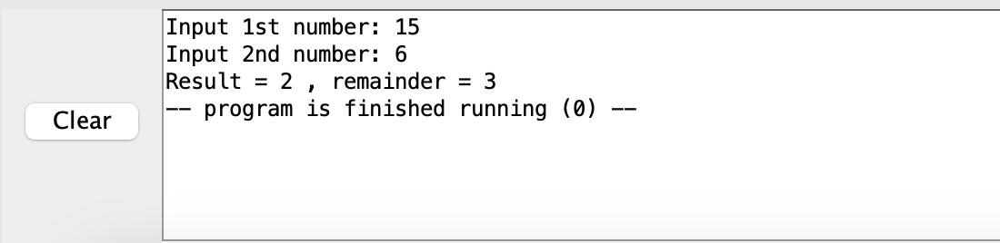
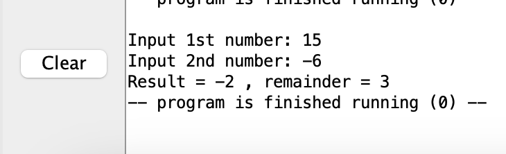
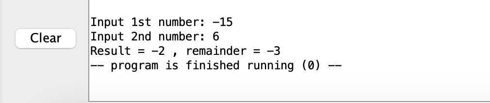
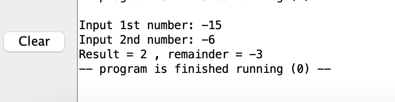
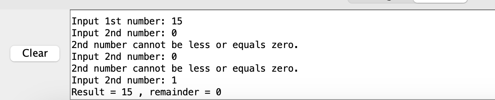
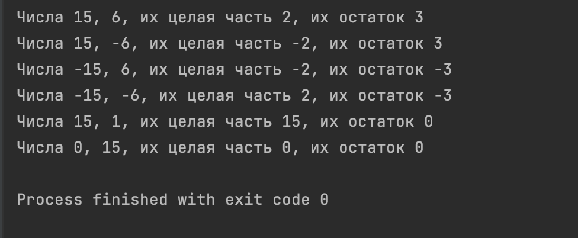

# АВС. Отчет по ДЗ №2. 
Тямин Илья БПИ226

## Код на ассемблере
Приведу сам код программы
```assembly
.data
	arg01:  .asciz "Input 1st number: "
	arg02:  .asciz "Input 2nd number: "
	incorr: .asciz "2nd number cannot be less or equals zero. \n"
	result: .asciz "Result = "
	remaind: .asciz " , remainder = "

.text
	# Вывод строки
	la a0 arg01
	li a7 4
	ecall
	
	# Ввод делимого
	input_number:
	li a7 5
	ecall
	mv s1 a0  # s1 - делимое
	
	input_divider:
	# Ввод делителя
	la a0 arg02
	li a7 4
	ecall
	li a7 5
	ecall
	mv s2 a0   # s2 - делитель
	beqz s2 print_error # если делитель 0, то принтим ошибку и повторяем ввод
	j main_cycle
	
	print_error:
	la a0 incorr
	li a7 4
	ecall
	j input_divider
	
	main_cycle:
	mv s3 zero # объявление числа целых
	bgtz s1 greater # ветвление на 4 случая: >0>0, >0<0, <0>0, <0<0
	bltz s1 less
	greater:
	bgtz s2 greater_greater
	bltz s2 greater_less
	less:
	bgtz s2 less_greater
	bltz s2 less_less
	
	
	greater_greater: # >0>0
	blt s1 s2 print_info
	sub s1 s1 s2
	addi s3 s3 1
	j greater_greater
	
	
	greater_less: # >0<0
	mv s4 s2
	sub s2 s2 s2
	sub s2 s2 s4 # по факту div -= 2*div
	j loop1
	loop1:
	blt s1 s2 print_info
	sub s1 s1 s2
	addi s3 s3 -1
	j loop1
	
	
	less_greater: # <0>0
	mv s4 s2
	sub s2 s2 s2
	sub s2 s2 s4 # по факту div -= 2*div
	j loop2
	loop2:
	bgt s1 s2 print_info
	sub s1 s1 s2
	addi s3 s3 -1
	j loop2
	
	
	less_less: # <0<0
	bgt s1 s2 print_info
	sub s1 s1 s2
	addi s3 s3 1
	j less_less
	
	print_info:
	la a0 result 
	li a7 4
	ecall # печатаем строку
	li a7 1
	mv a0 s3
	ecall # печатаем число операций
	la a0 remaind 
	li a7 4
	ecall # печатаем строку
	li a7 1
	mv a0 s1
	ecall # печатаем остаток 
	
	li a7 10 # выход
	ecall
```

## Всевозможные кейсы
Здесь и далее num - искомое число, div - на что делим
### Случай №1. num > 0, div > 0


### Случай №2. num > 0, div < 0


### Случай №3. num < 0, div > 0


### Случай №4. num < 0, div < 0


### Случай №5. div = 0; ввод некорректный
Делить на 0 нельзя, поэтому если пользователь ввел div = 0, то мы перезапрашиваем ввод, пока он не введет корректное число. Сюда же и относиться кейс, если num = 0 && div = 0, так как будет просто перезапрошен ввод div.


### Случай №6. num = 0, div != 0
Также здесь описан случай целочисленного деления (подкейс случай №1) - 15 %1 = 0.


## Вывод
Таким образом, мы рассмотрели всевозможные комбинации тестового покрытия (>0>0, >0<0, <0>0, <0<0, div=0). Программа работает корректно, не завершает свою работу при каких-либо корректных входных данных, все случаи описаны. Кроме того, результаты деления и остатка написаны в соответствии с правилами их реализации на языке С++. Убедиться в этом легко, запустив следующую программу на языке C++

```cpp
void PrintDivAndMod(int a1, int a2) {
    printf("Числа %d, %d, их целая часть %d, их остаток %d \n", a1, a2, a1 / a2, a1 % a2);
}
int main() {
    PrintDivAndMod(15, 6);
    PrintDivAndMod(15, -6);
    PrintDivAndMod(-15, 6);
    PrintDivAndMod(-15, -6);
    PrintDivAndMod(15, 1);
    PrintDivAndMod(0, 15);
    return 0;
}
```
Вывод с консоли:

Легко убедиться в том, что результаты совпадают.