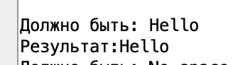
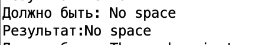
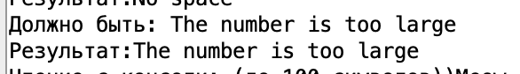
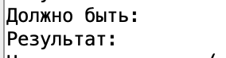
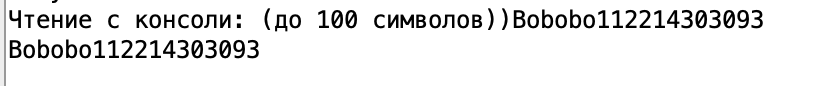

# АВС. Отчет по ДЗ №6. 
## Тямин Илья БПИ226 

Задание:

> До 8 баллов
>
>Написать подпрограмму, осуществляющую копирование строки символов аналогично функции strncpy языка программирования C. Протестировать функцию на различных комбинациях данных. Ознакомиться с функцией можно в системе справки по библиотеке языка C, которая имеется в различных источниках информации. Исходные данные для тестирования задавать как при вводе с консоли, так и с использованием строк символов в разрабатываемой программе (по аналогии с программами, рассмотренными на семинаре). Подпрограмму вынести в отдельный файл.
>
>Опционально до +2 баллов
>
>Дополнительно к подпрограмме разработать соответствующий макрос, расширив тем самым макробиблиотеку строк символов.


**Работа выполнена на 10 баллов**

## Код программы на ассемблере (10 б.)
Код удобнее смотреть в папке [code](/code/), но прикреплю и тут его.

Код [основной программы](/code/main.asm) (в т.ч. и тестирующей):
```assembly
.include "macrolib.asm"

.data
str1: 	.asciz "Hello"
str2:	.space 7

str3: 	.asciz "No space for this string"
str4:	.space 10

str5:	.asciz "The number is too large"
str6:	.space 25

str7:	.space 102
str8:	.space 102

str9:	.asciz ""
str10:	.space 3

.text
main:
	# Тест №1
	la a0 str1
	la a1 str2
	li a2 5
	jal strncpy
	la a1 str2
	print_string("Должно быть: Hello\nРезультат:")
	print_str_adr(a1)
	newline
	
	# Тест №2
	la a0 str3
	la a1 str4
	li a2 8
	str_copy(a0, a1, a2)
	la a1 str4
	print_string("Должно быть: No space\nРезультат:")
	print_str_adr(a1)
	newline
	
	# Тест №3
	la a0 str5
	la a1 str6
	li a2 100
	str_copy(a0, a1, a2)
	la a1 str5
	print_string("Должно быть: The number is too large\nРезультат:")
	print_str_adr(a1)
	newline
	
	# Тест №4
	la a0 str9
	la a1 str10
	li a2 1
	str_copy(a0, a1, a2)
	la a1 str10
	print_string("Должно быть: \nРезультат:")
	print_str_adr(a1)
	newline
	
	# Тест №5
	print_string("Чтение с консоли: (до 100 символов))")
	la a0 str7
	li a1 102
	li a7 8
	ecall
	jal strlen # в a2 запишется кол-во символов
	la a0 str7
	la a1 str8
	str_copy(a0, a1, a2)
	la a1 str8
	print_str_adr(a1)
	newline
	
	exit
```

Код [макробиблиотеки](/code/macrolib.asm) (включая разработанный макрос)
```assembly
#
# Example library of macros.
#

# Печать целого числа x
.macro print_int (%x)
	li a7, 1
	mv a0, %x
	ecall
.end_macro

# Печать целого числа x
.macro print_imm_int (%x)
    li a7, 1
    li a0, %x
    ecall
.end_macro

# Ввод целого числа с консоли в регистр a0
.macro read_int_a0
   li a7, 5
   ecall
.end_macro

# Ввод целого числа с консоли в указанный регистр, НО НЕ a0
.macro read_int(%x)
   push	(a0)
   li a7, 5
   ecall
   mv %x, a0
   pop	(a0)
.end_macro

# Печать строки x
   .macro print_string (%x)
   .data
str:
   .asciz %x
   .text
   push (a0)
   li a7, 4
   la a0, str
   ecall
   pop	(a0)
   .end_macro

# Печать символа x
   .macro print_char(%x)
   li a7, 11
   li a0, %x
   ecall
   .end_macro

   .macro newline
   print_char('\n')
   .end_macro

# Завершение программы
.macro exit
    li a7, 10
    ecall
.end_macro

# Сохранение заданного регистра на стеке
.macro push(%x)
	addi	sp, sp, -4
	sw	%x, (sp)
.end_macro

# Выталкивание значения с вершины стека в регистр
.macro pop(%x)
	lw	%x, (sp)
	addi	sp, sp, 4
.end_macro

.macro print_str_adr(%x)
	mv a0 %x
	li a7 4
	ecall
.end_macro

.macro str_copy(%old_str, %memr, %num)
	li t0 0
	j loop_strn
	
loop_strn:
	beq t0 %num end # если превышаем кол-во нужных символов (число), то end
	lb t1 (%old_str)
	sb t1 (%memr) # сохраняем символ в новую строку
	
	beqz    t1 end # если строка закончилась, то выходим
	addi t0 t0 1 # переходим к следующему символу
	addi    %old_str %old_str 1
	addi    %memr %memr 1
	j loop_strn # цикл
end:
.end_macro

```

Код [подпрограмм](/code/subprogramm.asm) (подпрограммы strlen и strncpy):
```assembly
.include "macrolib.asm"
.global strncpy, strlen

 .text

# Принимает в a0 - указатель на строку откуда копировать
# Принимает в a1 - указатель на строку куда копировать
# Принимает в a2 - количество символов для копирования
strncpy:
	li t0 0
	j loop_strn
	
loop_strn:
	beq t0 a2 end # если превышаем кол-во нужных символов (число), то end
	lb t1 (a0)
	sb t1 (a1) # сохраняем символ в новую строку
	
	beqz    t1 end # если строка закончилась, то выходим
	addi t0 t0 1 # переходим к следующему символу
	addi    a0 a0 1
	addi    a1 a1 1
	j loop_strn # цикл
end:
	ret
	

strlen:
    li      t0 0        # Счетчик
loop:
    lb      t1 (a0)   # Загрузка символа для сравнения
    beqz    t1 end_l
    addi    t0 t0 1		# Счетчик символов увеличивается на 1
    addi    a0 a0 1		# Берется следующий символ
    b       loop
end_l:
    mv      a2 t0
    ret
fatal_l:
    li      a2 -1
    ret

```

## Описание кода (как он работает)
Как уже понятно, программа разделена на 3 файла:
- файл основной программы с вызовом тестов
- файл макробиблиотеки, в которой находятся вспомогательные макросы, включая разработанный на 10 баллов макрос strncpy
- файл подпрограмм:
    - strlen
    - strncpy

Кратко рассмотрим каждый из файлов
### Файл основной программы с вызовом тестов
Здесь не происходит ничего особенного. 
Подключаем макробиблиотеку с помощью `.include "macrolib.asm"`, далее проводим тесты (их я рассмотрю далее).

Структура выполнения теста такова (для уже готовых в памяти строк):
1. Загрузить в регистр `a0` адрес исходной строки
2. Загрузить в регистр `a1` место в памяти, куда нужно копировать исходную строку
3. Загрузить в регистр `a2` количество копируемых символов
4. Или вызвать подпрограмму с помощью jal, или вызвать макрос (в разных тестах я использовал по-разному, чтобы показать работоспособность в разных случаях)
5. Снова загрузить указатель на начало памяти, куда была скопирована строка
6. Вывести строку с помощью вспомогательного макроса.

Структура выполнения теста в случае ввода строки пользователем с помощью клавиатуры та же, однако предварительно перед вызовом 4-го системного вызова необходимо в `a0` поместить память куда записывать строку, а в `a1` максимальное количество символов в буфере.

### Файл макробиблиотеки
Макробиблиотека базирована на макробиблиотеке, написанной в предыдущих домашних заданиях, однако в нее было добавлено еще 2 макроса:
#### print_str_adr(%x)
Печатает строку по ее адресу (реализация очевидна)

#### str_copy(%old_str, %memr, %num)
Реализация данного макроса полностью совпадает с реализацией основной подпрограммы strncpy. Рассмотрим ее в следующем блоке.

### Файл подпрограмм
#### strncpy
Данная подпрограмма принимает три параметра:
1. В регистре `a0` исходную строку
2. В регистре `a1` место, куда нужно копировать
3. В регистре `a2` количество символов.

Представлю схему реализации алгоритма:
1. Объявим счетчик считанных символов в `t0`. Начнем цикл
2. Проверка: превысили ли допустимое количество символов `a2`. Если да, то переходим в конец
3. Загружаем символ из `a0` и сохраняем его в `a1`.
4. Проверка: загруженный символ из `a0` - нулевой? Если да, то переходим в конец
5. Инкрементируем обе строки на следующий символ + увеличиваем счетчик считанных символов

Конец: выходим из подпрограммы.

Еще раз реализация на ассемблере:
```assembly
strncpy:
	li t0 0
	j loop_strn
	
loop_strn:
	beq t0 a2 end # если превышаем кол-во нужных символов (число), то end
	lb t1 (a0)
	sb t1 (a1) # сохраняем символ в новую строку
	
	beqz    t1 end # если строка закончилась, то выходим
	addi t0 t0 1 # переходим к следующему символу
	addi    a0 a0 1
	addi    a1 a1 1
	j loop_strn # цикл
end:
	ret
```

Таким образом проверяется оба возможных случая: количество символов меньше, чем длина строки и количество символов больше, чем длина строки.

#### strlen
Реализация аналогична той, которая разбиралась на семинаре.

## Тестовое покрытие
Если что, все тесты удобно посмотреть сразу в main, они все пронумерованы также, как и тут.
### Тест №1. Длина строки = кол-во символов в a2
Исходная строка: Hello



### Тест №2. Длина строки > кол-во символов в a2
Исходная строка: No space for this string



### Тест №3. Длина строки < кол-во символов в a2
Исходная строка: The number is too large



### Тест №4. Пустая строка
Исходная строка: 




### Тест №5. Ввод пользователем с клавиатуры



## Бонус
