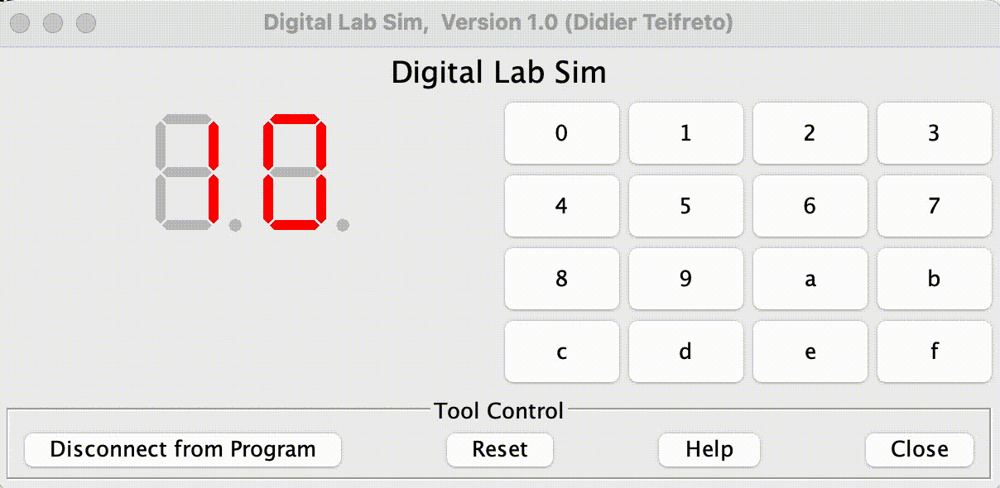

# АВС. Отчет по ДЗ №7. 
## Тямин Илья БПИ226 

Задание:

> До 8 баллов:
>
>Разработать подпрограмму, которая выводит на индикатор  цифрового блока цифру, передаваему через регистр a0. Адрес (левого или правого) индикатора задается в регистре a1. Если число в регистре a0 превышает шестнадцатиричную цифру, то учесть только младшие 4 разряда и выводить дополнительно точку. Для демонстрации написать программу, вызывающую эту подпрограмму, которая в цикле с задержкой (системный вызов sleep), каждую секунду выводит по циклу очередное значение в начале на один, а затем на другой индикатор.


**Работа выполнена на 8 баллов**

## Код программы на ассемблере 
Код удобнее смотреть в папке [code](/code/), но прикреплю и тут его.

Код [основной программы](code/main.asm) (в данном ДЗ - код подпрограммы-цикла с вызовом sleep)
```assembly
.include "macrolib.asm"


.text
li t2 0
li t1 0xffff0010
li t0 2
test_program:
	add a0 t2 zero
	rem t3 t2 t0
	add a1 t1 t3
	jal setDigit
	addi t2 t2 1
	
	li a0 1000
	li a7 32
	ecall
	
	li t3 20
	ble t2 t3 test_program
	j end
	
end:
exit
```

Код [макробиблиотеки ](code/macrolib.asm) приводить здесь не буду, так как он идентичен предыдущим ДЗ (в библиотеке ничего не поменялось с ДЗ-6). В коде макробиблиотека используется только для выхода из программы (`exit`).

Код [подпрограммы](code/subprogramm.asm), отвечающей за отображение цифры на цифровом блоке (тут много).
```assembly
.include "macrolib.asm"

.global setDigit

.text
# Вход: в регистре a0 цифра, в регистре a1 - левый или правый индикатор
setDigit:
	li t4 10

	lui t6 0xffff0  
	j getNumberUsingRegister
	
	afterGettingNumber:
	li t5 0x80
	mul t3 t3 t5
	or a0 a0 t3
	
	li t5 0xffff0011
	beq a1 t5 left
	li t5 0xffff0010
	beq a1 t5 right

	left:
	sb  a0 0x11(t6)
	ret
	
	right:
	sb  a0 0x10(t6)
	ret

    
getNumberUsingRegister:
	li t5 10
	li t3 0
	bge a0 t5 modifyNumber
	j instruct
	
	modifyNumber:
	rem a0 a0 t5
	li t3 1
	j instruct
	
	instruct:
	li t5 0
	beq a0 t5 zero_noDot
	li t5 1
	beq a0 t5 one_noDot
	li t5 2
	beq a0 t5 two_noDot
	li t5 3
	beq a0 t5 three_noDot
	li t5 4
	beq a0 t5 four_noDot
	li t5 5
	beq a0 t5 five_noDot
	li t5 6
	beq a0 t5 six_noDot
	li t5 7
	beq a0 t5 seven_noDot
	li t5 8
	beq a0 t5 eight_noDot
	li t5 9
	beq a0 t5 nine_noDot
	
zero_noDot:
	li a0 0x3f
	j afterGettingNumber
one_noDot:
	li a0 0x6
	j afterGettingNumber
two_noDot:
	li a0 0x5b
	j afterGettingNumber
three_noDot:
	li a0 0x4f
	j afterGettingNumber
four_noDot:
	li a0 0x66
	j afterGettingNumber
five_noDot:
	li a0 0x6d
	j afterGettingNumber
six_noDot:
	li a0 0x7d
	j afterGettingNumber
seven_noDot:
	li a0 0x7
	j afterGettingNumber
eight_noDot:
	li a0 0x7f
	j afterGettingNumber
nine_noDot:
	li a0 0x6f
	j afterGettingNumber
```

## Описание кода 
### Подпрограмма
Основная функция подпрограммы - печатать число, которое пользователь передал в регистр `a0` на цифровом индикаторе (правый или левый), указатель на который передал пользователь в регистре `a1`. 

1. Изначально командой `lui t6 0xffff0` мы устанавливаем первые 20 бит в регистра `t6`. Это позволяет работать с MMIO, так как адреса MMIO начинаются с 0xfffff....
2. Далее мы уходим в метку `getNumberUsingRegister`, которая по заданной цифре (от 0 до 9) отдает в регистр `a0` специальное шестнадцатиричное число, говорящее индикатору какие блоки стоит активировать. В Digital Lab Sim индикаторы работают так: в специальный регистр надо поместить число, $i$-й байт которого отвечает за активацию определенной линии в индикаторе ($i \in [0, 1]$). Описание номеров линий в каждом из индикаторов было представлено в презентации на семинаре (например, для 8ки нужно отобразить все "отрезки", для 9ки все отрезки кроме 7го, так как это точка, и кроме 4го). 

Таким образом, можно представить для каждой из цифр ее представление в индикаторе чисел RARS:
```
dictionary = {0 : 0b00111111,
              1 : 0b00000110,
              2 : 0b01011011,
              3 : 0b01001111,
              4 : 0b01100110,
              5 : 0b01101101,
              6 : 0b01111101,
              7 : 0b00000111,
              8 : 0b01111111,
              9 : 0b01101111
			  }
```
В коде на ассемблере я просто преобразовал двоичную систему счисления в шестнадцатиричную. 
Возвращаясь непосредственно к коду на ассемблере, сначала программа преобразует предоставленное пользователем число в вид $[0; 9]$. Если число уже представлено в таком формате, то программа его и использует, иначе просто берется последняя цифра этого числа, при этом в регистр $t3$ записывается цифра 1. Далее разработанная программа меняет число на описанное выше значение. 

3. После этого, если число было больше 9 (то есть пришлось брать последнюю цифру числа), по условию необходимо еще поставить точку рядом с полученной цифрой. За точку отвечает 7й бит в исходном представлении. Чтобы проставить 7й бит, для этого можно воспользоваться битовой операцией `or` с числом 0b10000000 в двоичном представлении (в шестнадцатиричном оно будет иметь вид 0x80). Данная операция просто доставляет 1 на соответствующий бит, с другими ничего не делает, так как `X or 0 = X`.

4. Затем необходимо посмотреть, в левый или правый индикатор мы записываем число. Проверяем адреса, переходим в соответствующую метку.

5. В зависимости от метки, сохраняем содержимое `a0` по адресу `0x11 + t6`, если индикатор левый или `0x10 + t6`, если индикатор правый. 

### Описание основной программы
1. Введем регистры: $t2$ - счетчик сколько чисел мы отобразили уже на экране, $t1$ - адрес правого индикатора, $t0$ - цифра 2.
2. Циклом проходимся от 0 до 20 (чтобы показать еще и числа с точкой). В $a0$ загружаем текущее число. По заданию, мы должны поочередно отображать число то в левом индикаторе, то в правом индикаторе. Я это реализовал как $t1 + (a0 \ mod \ 2)$
3. На каждой итерации вызываем разработанную подпрограмму. 
4. Вызываем "засыпание" программы на 1000 мс с помощью системного вызова 32. 
5. Переходим к следующей итерации

## Демонстрация работы программы
(тут должен воспроизводиться gif)


## Бонус!
