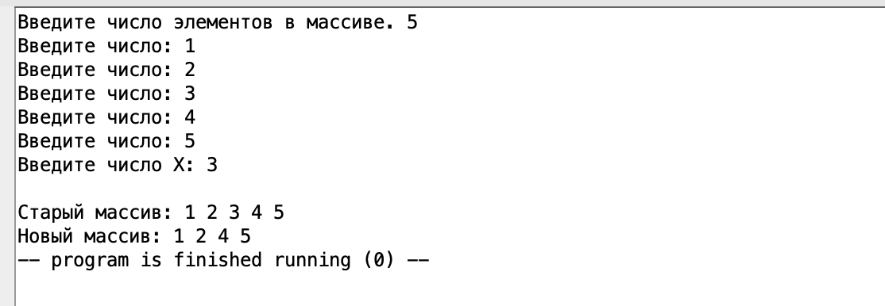
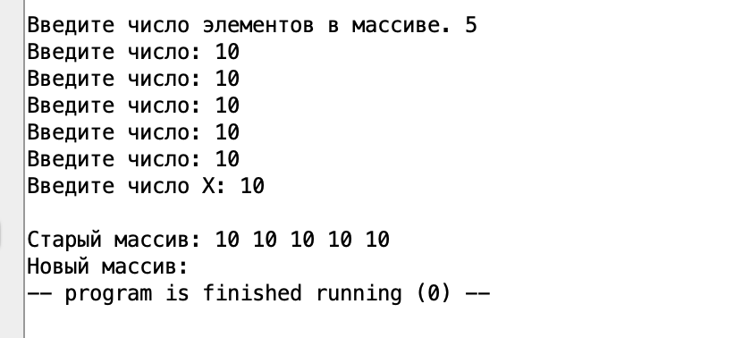
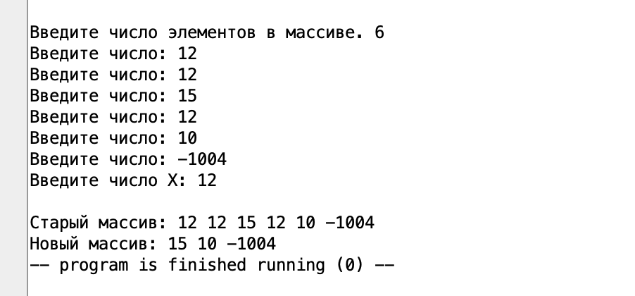
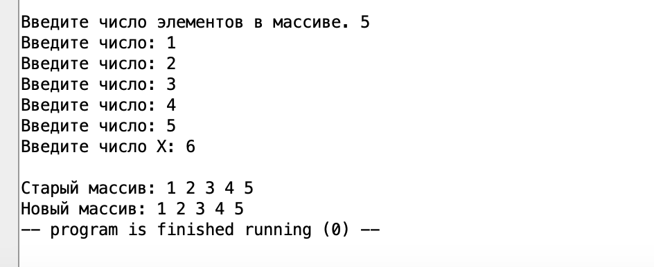
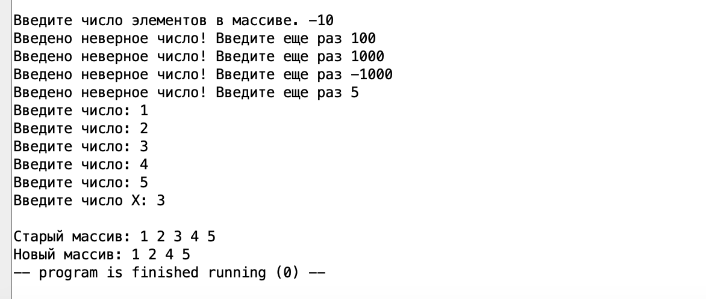
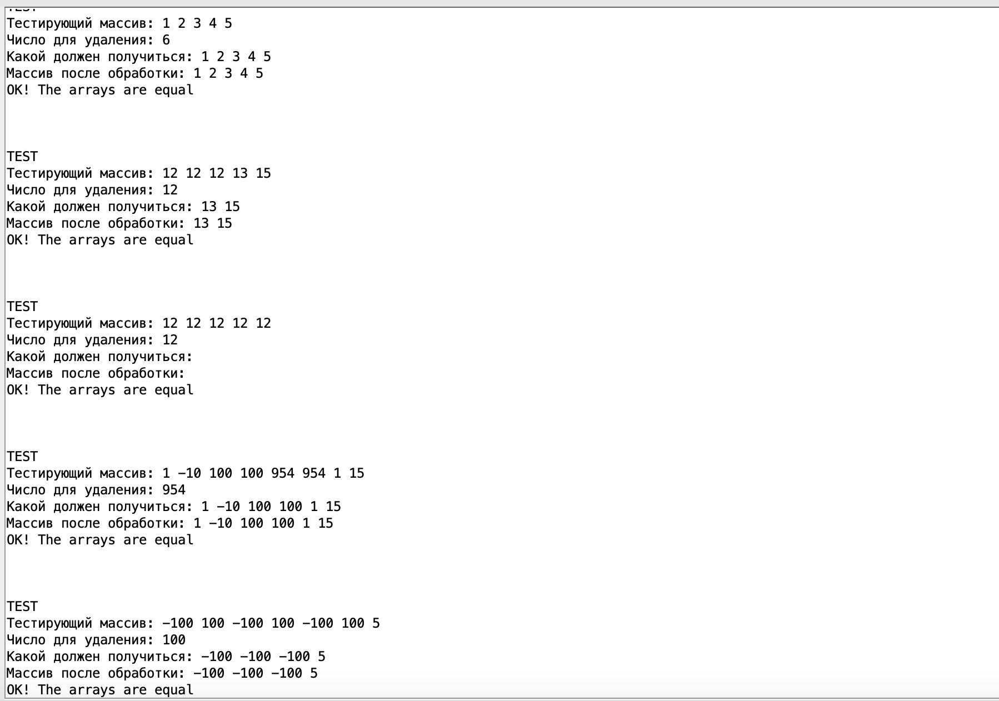

# ИДЗ №1 по курсу "Архитектура вычислительных систем"
## Тямин Илья Игоревич, БПИ-226
Вариант №5. Сформировать массив $B$, состоящий из элементов массива , значение которых не совпадает с введённым числом $X$.

Выполнил все критерии, соответствующие 10 баллам. 

[Ссылка на папку с кодом программы, включая тестирующую программу](/code/)

## О структуре программы
Программа состоит из нескольких единиц компиляции, а точнее из:
- [основной программы](/code/program.asm) (main), в которой написана общая логика программы
- [макробиблиотеки](/code/macrolib.asm), содержащую макросы для частовыполняемых задач, такие как ввод/вывод числа, строки, вставка / удаление из стека. Также в макробиблиотеке отдельно находится макрос для печати массива A длины B, макрос сравнения на равенство двух массивов A и B и макрос, тестирующий функционал приложения на определенных входных данных. Последние 2 макроса нужны для тестирующей программы, о ней будет рассказано позже.
- [библиотеки подпрограмм](/code/subprogramms.asm), содержащую подпрограммы:
  - ввод числа элементов и проверка числа на корректность
  - считывание массива длины N
  - создание нового массива согласно условию варианта №5
- [подпрограмму-тестер](/code/tester.asm), реализующую механику тестирования основной программы на различных входных данных. \
 **Чтобы включить тестер, необходимо просто добавить в начало основной программы jal testing, тем самым произойдет вызов тестирующей подпрограммы.**

 ## Кратко о коде
 В коде мною были оставлены комментарии, чтобы облегчить чтение программы, однако все равно кратко пройдемся по каждому из файлов

 ### Основная программа
 [еще раз ссылка](/code/program.asm)
 ```assembly
 .include "macrolib.asm"

.global main


.data
	.align 2
	array: .space 64 # Максимальное кол-во элементов
	new_array: .space 64 # Память под новый массив

.text
main:
	# РАСКОММЕНТИРУЙТЕ ЭТУ СТРОКУ, если хотите запустить автотестинг
	#jal testing 
	
	
	la s1 array # s1 - указатель на начало
	la s3 new_array # s3 - указатель на новый массив
	print_string("Введите число элементов в массиве. ")
	
	# На вход ничего - на выходе в регистре a1 количество элементов
	jal input_num_elements # Вызов подпрограммы ввода числа элементов
	mv s0 a1 # Количество элементов в исходном массиве
	
	push(s0) # Добавляем количество элементов массива в стек

	# На вход - место для массива; количество элементов через стек, на выход - ничего
	jal read_mas # Ввод массива

	
	print_string("Введите число X: ")
	read_int(s2) # Вводим число X в регистр s2
	
	la s1 array # Устанавливаем указатель на первый элемент array
	push(s0)
	push(s2) # Передаем через стек кол-во элементов и число X

	# На вход - кол-во элементов в старом и число X через стек, на выход - кол-во элементов в регистре a1
	jal make_new_array # Конструируем новый массив
	mv s4 a1 # В s4 - количество элементов в новом массиве
	
	newline # Вывод данных
	la s1 array # s1 - указатель на начало
	la s3 new_array # s3 - указатель на новый массив
	print_string("Старый массив: ")
	print_mas(s1, s0) # Макрос для печати массива
	newline
	print_string("Новый массив: ")
	print_mas(s3, s4)
	
	exit

 ```
 В начале с помощью `.include` мы подключаем файл с библиотекой макросов, так как внутри мы используем макроопределения, такие как print_string, print_mas и другие. \
 В секции `data` объявляем место под array (введенный пользователем массив) и под new_array (массив, полученный после обработки программой) - место выделил с запасом. `.align` использую для выравнивания по ширине ворда.  

 В основной программе мы можем сначала вызвать тестирующую программу, которая произведет тестировку на различных входных данных. Затем мы добавляем в регистры `s1` и `s3` указатели на первые элементы массивов array и new_array соответственно. 

Выводим строку и запрашиваем у пользователя число элементов с помощью вызова подпрограммы `input_num_elements`. Подпрограмма вернет количество элементов в регистр a1. Перемещаем его с помощью команды `mv` в регистр `s0`.

Затем, с помощью макроса `push` кладем и передаем через стек количество элементов. Вызываем подпрограмму вывода массива, где принимаем и удаляем из стека это количество элементов, затем используем его по назначению (таким образом я показал передачу данных в подпрограммы через стек).

Затем пользователь вводит число `X`. После этого мы формируем новый массив, вызывая командой `jal` подпрограмму `make_new_array`, но перед этим передаем через стек кол-во элементов в исходном массиве и число `X`.

В конце выводим все данные на экран, используя написанные в макробиблиотеке макросы: `print_string`, `print_mas`, `newline`, `exit`.


 ### Макробиблиотека
 [еще раз ссылка](/code/macrolib.asm) \
Код слишком большой :(, поэтому не буду вставлять, однако он доступен по ссылке. 

Опишу основные написанные макросы и как реализовал (если реализация сложная, а не интуитивно простая)
- Вывод числа на экран (`print_int`).
- Ввод целого числа с консоли в регистр a0 (`read_int_a0`)
- Ввод целого числа с консоли в указанный регистр, НО НЕ a0 (`read_int (%x)`). \
В начале сохраняем на стек `a0`, в конце его возвращаем на место.
- Печать строки (`print_string (%x)`). \
Здесь мы объявляем внутри секцию data, в которой объявляем строку. В секции text сохраняем и возвращаем регистр `a0` на случай, если там что-то уже лежало.
- Печать символа (`print_char (%x)`)
- Перевод на новую строку (`printline`)
- Завершение программы (`exit`)
- Сохранение заданного регистра на стеке (команда push) (`push(%x)`)
- Выталкивание значения с вершины стека в регистр (команда pop) (`pop(%x)`)
- Печать вещественного числа (`print_double(%x)`)
- Макрос тестировки (`test(%num, %approx_result)`). Получает число `%num`, которое передает в подпрограмму `get_root` и число `%approx_result`, которое (примерно) должно получиться в ходе работы подпрограммы

 ### Библиотека подпрограмм
 [еще раз ссылка](/code/subprogramms.asm) 
```
.include "macrolib.asm"

.global input_num_elements, read_mas, make_new_array

.text

input_num_elements:
	push(ra) # Тут я показываю, что умею пользоваться стеком
	# Запрашиваем число элементов
	read_int(t0)
	j check_num_borders
	
	check_num_borders:
	li t3 1 # Левая граница допустимого N
	li t4 10 # Правая граница допустимого N
	blt t0 t3 not_correct_numb_elements
	bgt t0 t4 not_correct_numb_elements
	pop(ra)
	mv a1 t0 # По правилам выходные данные в регистрах a0-a1
	ret
	
	not_correct_numb_elements:
	print_string("Введено неверное число! Введите еще раз ")
	j input_num_elements

# Подпрограмма, считывающая массив
read_mas:
	pop(t1) # s0, передали через стек
	push(ra) # Добавляем в стек текущий регистр возврата
	
	mv t3 s1
	li t2 0 # Счетчик i
	j loop
	loop:
	bgeu t2 t1 end # t2 >= t1 -> end
	print_string("Введите число: ")
	read_int_a0 # считываю число в регистр a0
	sw a0 (t3) 
	addi t3 t3 4 # шаг вперед
	addi t2 t2 1
	j loop
	
	end:
	pop(ra) # Восстаналиваем регистр возврата
	ret
	
make_new_array:
	# Логика такова: если число не X, то вставляем в массив, иначе нет
	pop(t0) # t0 - число X со стека
	pop(t1) # t1 - кол-во чисел в изначальном массиве со стека
	push(ra) # Добавляем в стек регистр возврата
	
	mv t5 s1 # t5 - УКАЗАТЕЛЬ на первый элемент старого массива
	mv t4 s3 # t4 - УКАЗАТЕЛЬ на первый элемент нового массива
	
	li t2 0 # кол-во считанных чисел с изначального массива
	li a1 0 # количество чисел в новом массиве
	j loop_new
	
	loop_new:
	bgeu t2 t1 new_arr_end
	
	lw t3 (t5) # выгружаем число с array
	addi t5 t5 4
	addi t2 t2 1
	bne t0 t3 add_numb # если числа не совпадают, то добавляем в массив, иначе нет
	j loop_new
	
	add_numb: # Если число ок, то добавляем его в стек
	addi a1 a1 1
	sw t3 (t4)
	addi t4 t4 4
	j loop_new
	
	new_arr_end:
	pop(ra) # Восстанавливаем регистр возврата
	push(a1) # Показываю, что я умею пользоваться стеком :)
	ret
	
```
Подключаю используемую библиотеку макросов с помощью `.include`, объявляю глобальными метки трех подпрограмм.

Здесь стоит обратить внимание на 3 основных подпрограммы:

#### `input_num_elements`
В начале добавляю в стек адрес возврата, в конце его возвращаю (компетенция пользования стеком внутри подпрограммы), кроме того это нужно, чтобы адрес возврата случайно не поменялся в результате работы подпрограммы и вызова других меток. \
Считываем у пользователя число, проверяем что оно $1 \leq n \leq 10$. Если число не соответствует требованиям, то перезапрашиваем его.

#### `read_mas`
Подпрограмма, отвечающая за считывание массива.
На вход подпрограмме в main-е передается количество элементов через стек, с помощью макроса `pop` достаем из стека и размещаем в соответствующем регистре. Далее считываем $n$ чисел, перемещая указатель памяти на 4 (так как это длина стандартного числа), а также увеличивая счетчик считанных чисел.

#### `make_new_array`
Достаем из стека число $X$ и кол-во изначальных данных в старом массиве (ранее мы их передали через стек с основной программы). Логика работы такова: проходимся по старому массиву циклом, если число не равно $X$, то добавляем его в новый массив, иначе переходим к следующему элементу. На выходе передаем через регистр `a1` количество элементов в новом массиве. 

 ### Тестирующая подпрограмма
 [еще раз ссылка](/code/tester.asm) 
 ```assembly
 .include "macrolib.asm"

.global testing

.data
	# Различные тестовые данные
	.align 2
	mas1: .word 1,2,3,4,5
	correct_mas1: .word 1,2,3,4,5
	real_arr1: .space 20
	
	mas2: .word 12,12,12,13, 15
	correct_mas2: .word 13, 15
	real_arr2: .space 8
	
	mas3: .word 12,12, 12, 12, 12
	correct_mas3: .word 
	real_arr3: .space 0
	
	mas4: .word 1, -10, 100, 100, 954, 954, 1, 15
	correct_mas4: .word 1, -10, 100, 100, 1, 15
	real_arr4: .space 32
	
	mas5: .word -100, 100, -100, 100, -100, 100, 5
	correct_mas5: .word -100, -100, -100, 5
	real_arr5: .space 16
	
	
.text
testing:
	push(ra) # Запоминаем регистр возврата
	test(mas1, 5, real_arr1, 6, correct_mas1, 5) # кейс, когда ничего не удаляется
	test(mas2, 5, real_arr2, 12, correct_mas2, 2) # кейс когда удаляется большинство
	test(mas3, 5, real_arr3, 12, correct_mas3, 0) # кейс, когда удаляется все
	test(mas4, 8, real_arr4, 954, correct_mas4, 6) # кейс, когда удаляется из середины
	test(mas5, 7, real_arr5, 100, correct_mas5, 4) # кейс 2, когда удаляется через один
	
	pop(ra) # Удаляем регистр возврата
	ret

 ```
 В секции `data` объявляем тестирующие данные: всего у нас 5 блоков, в каждом из который `masI` (I - это число) - это массив, который вводит пользователь (имитация), `correct_masI` - массив, который должен получиться в результате работы программы, `real_arrI` - место под массив, который делает программа. \
 В секции `text` объявляем метку `testing` (выше мы ее делаем глобальной). Аналогично предыдущим подпрограммам, пушаем и удаляем регистр `ra` в начале и конце для его сохранения. Внутри 5 раз (для каждого из объявленных "блоков" данных) вызываем специальный макрос `test`, передавая туда вышеописанные параметры. 

 Что делает макрос `test`? Грубо говоря, имитирует работы программы
 - Печатает исходный массив
 - Формирует новый массив в специально отведенной памяти
 - Печатает новый массив
 - Макро `compare` сравнивает массив, который должен получиться и который получился. Всего лишь запустив, легко убедиться, что на всех данных макрос выводит "OK!" :)

```assembly

# Макрос для тестировки
.macro test(%input, %num_input, %output, %number, %correct, %num_correct)
	# ИМИТАЦИЯ работы main
	la s1 %input
	li s0 %num_input
	li s2 %number
	print_string("\nTEST\n")
	print_string("Тестирующий массив: ")
	print_mas(s1, s0) 
	print_string("\nЧисло для удаления: ")
	print_int(s2)
	print_string("\nКакой должен получиться: ")
	la s3 %correct
	li s5 %num_correct
	print_mas(s3, s5)
	newline
	
	la s1 %input
	la s3 %output
	push(ra)
	push(s0)
	push(s2)
	jal make_new_array
	pop(s4)

	
	print_string("Массив после обработки: ")
	
	print_mas(s3, s4) 
	
	la s1 %input
	la s3 %output
	compare_arrays(%correct, %num_correct, %output, s4)
	
	pop(ra)
	newline
	newline
.end_macro 
```


  **Чтобы включить тестер, необходимо просто добавить в начало основной программы jal testing, тем самым произойдет вызов тестирующей подпрограммы.**

## Тесты, демонстрирующие работы подпрограммы
### Введено 5 уникальных чисел, из них 1 совпадает с X


### Введено 5 одинаковых чисел, X с ними совпадает


### Введено 5 разных чисел, X совпадает с несколькими


### Введено 5 разных чисел, X не совпадает ни с одним


### Введено некорректное число чисел


### Результаты автопроверки


## Пройдемся еще раз по критериям!
### 10 баллов
- Программа должна быть разбита на несколько единиц компиляции. При этом подпрограммы ввода–вывода должны составлять унифицированные модули, используемые повторно как в программе, осуществляющей ввод исходных данных, так и в программе, осуществляющей тестовое покрытие. \
> Все верно. Моя программа разбита на 4 файла, подпрограммы ввода-вывода используются и в тестовой программе, и в основной программе.
- Макросы должны быть выделены в отдельную автономную библиотеку
> Все верно. Файл `macrolib.asm`

### 9 баллов
- Добавить в программу использование макросов для реализации ввода и вывода данных. Макросы должны поддерживать повторное использование с различными массивами и другими параметрами.
> Все верно.

### 8 баллов
- Разработанные подпрограммы должны поддерживать многократное использование с различными наборами исходных данных, включая возможность подключения различных исходных и результирующих массивов.
> Все верно. Для макросов мы передаем данные через параметры. Для остальных подпрограмм эта возможность также реализована.

- Реализовать автоматизированное тестирование за счет создания дополнительной тестовой программы, осуществляющей прогон подпрограммы обработки массивов с различными тестовыми данными (вместо ввода данных). Осуществить прогон тестов обеспечивающих покрытие различных ситуаций. Тестовые данные мож- но формировать в различных исходных массивах.
> Такая программа была создана и выше описана.

### 6-7 баллов
- В программе необходимо использовать подпрограммы с передачей аргументов через параметры, отображаемые на стек.
> Такие подпрограммы есть. Например, в некоторых я передаю через стек количество чисел.

- Внутри подпрограмм необходимо использовать локальные переменные, которые при компиляции отображаются на стек.
> И такие тоже есть. Очень часто мы локально используем `ra`, а также другие регистры.

- В местах вызова функции добавить комментарии, описывающие передачу фактических параметров и перенос возвращаемого ре- зультата. При этом необходимо отметить, какая переменная или результат какого выражения соответствует тому или иному фактическому параметру.
> Старался по мере кода показывать, какой регистр / переменная за что отвечает.

### 4-5 баллов
- Приведено решение задачи на ассемблере. Ввод данных осуществляется с клавиатуры. Вывод данных осуществляется на дисплей.
> ОК

- В программе должны присутствовать комментарии, поясняющие выполняемые действия.
> ОК

- В отчете должно быть представлено полное тестовое покрытие. Приведены результаты тестовых прогонов. Например, с использованием скриншотов.
> ОК

## Бонус!

