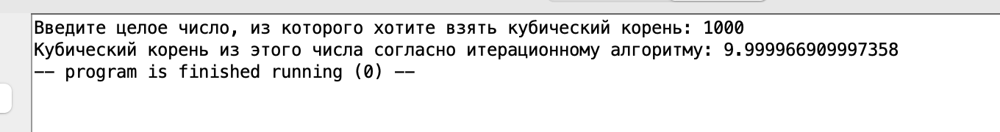
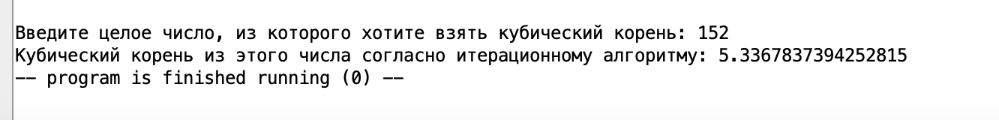
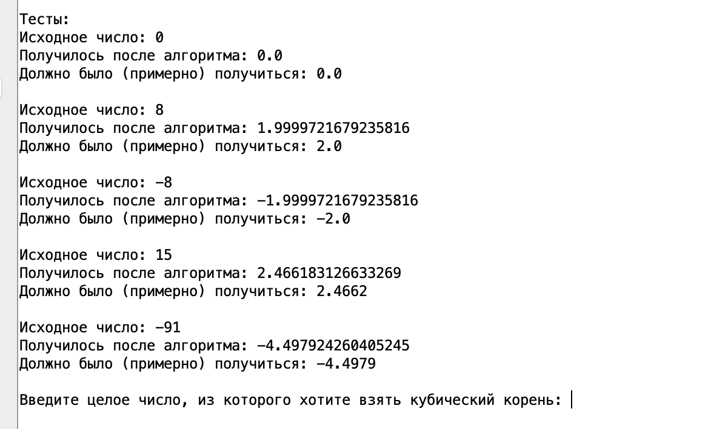

# ИДЗ №2 по курсу "Архитектура вычислительных систем"
## Тямин Илья Игоревич, БПИ-226
Об ИДЗ:
- Вариант №19
- **Условие:** Разработать программу вычисления корня кубического из заданного числа согласно быстро сходящемуся итерационному алгоритму определения корня n-ной степени с точностью не хуже 0,05%.
- Способ решения задачи: итерационный алгоритм определения корня n-й степени, описанный на [Хабре](https://habr.com/ru/articles/469735/).
- Выполнил все критерии, соответствующие 10 баллам.

[Ссылка на папку с кодом программы на ассемблере](/Assembly%20code/) 

[Ссылка на папку с кодом программы на C++](/C++%20Code%20/)

## О структуре программы
Программа состоит из нескольких единиц компиляции, а точнее из:
- [основной программы](/Assembly%20code/main.asm), реализующей переход в подпрограммы, ввод и вывод результата.
- [макробиблиотеки](/Assembly%20code/macrolib.asm). Макробиблиотека включает в себя макросы ввода и вывода целых чисел, вещественных чисел, строк, выход из программы, а также макрос для автоматического тестирования (об этом позже)/
- [подпрограммы подсчет кубического корня](/Assembly%20code/subprogram.asm). Ее мы также рассмотрим отдельно
- [тестирующей подпрограммы](/Assembly%20code/tester.asm), необходимой для автоматического тестирования подпрограммы. Чтобы запустить тестирующую подпрограмму необходимо раскомментировать строку ```jal testing```  в основной подпрограмме.

## Кратко о коде
### Основная программа
```assembly
.include "macrolib.asm"

.global main

.text 
main:
	# Раскомментируйте строку, чтобы запустить автотестинг
	#jal testing

	print_string("Введите целое число, из которого хотите взять кубический корень: ")
	read_int(s0)
	
	mv a2 s0
	
	# Подпрограмме вычисления корня на вход через регистр a2 подается целое число X. 
	# На выход программа в регистре fa0 отдает корень из числа.
	jal get_root
	fmv.d fs1 fa0
	
	print_string("Кубический корень из этого числа согласно итерационному алгоритму: ")
	print_double(fs1)
	
	exit
```
В начале с помощью ```.include ``` подключаем макробиблиотеку. Объявляем main. 

В начале программы можно раскомментировать строку ```jal testing ```, чтобы произвести автопроверку корректности работы программы. Далее, используя макросы ввода и вывода строк и чисел, считываем с клавиатуры число из которого берем кубический корень. Вызываем подпрограмму ```get_root```. 

Подпрограмме вычисления корня на вход через регистр a2 подается целое число X. На выход программа в регистре fa0 отдает корень из числа.

С помощью команды ```fmv.d``` переносим результат из регистра fa0 в регистр fs1. Выводи на экран всю информацию.

### Макробиблиотека
[ссылка на макробиблиотеку](/Assembly%20code/macrolib.asm)

Код слишком большой :(, поэтому не буду вставлять, однако он доступен по ссылке. 

Опишу основные написанные макросы и как реализовал (если реализация сложная, а не интуитивно простая)
- Вывод числа на экран (`print_int`).
- Ввод целого числа с консоли в регистр a0 (`read_int_a0`)
- Ввод целого числа с консоли в указанный регистр, НО НЕ a0 (`read_int (%x)`). \
В начале сохраняем на стек `a0`, в конце его возвращаем на место.
- Печать строки (`print_string (%x)`). \
Здесь мы объявляем внутри секцию data, в которой объявляем строку. В секции text сохраняем и возвращаем регистр `a0` на случай, если там что-то уже лежало.
- Печать символа (`print_char (%x)`)
- Перевод на новую строку (`printline`)
- Завершение программы (`exit`)
- Сохранение заданного регистра на стеке (команда push) (`push(%x)`)
- Выталкивание значения с вершины стека в регистр (команда pop) (`pop(%x)`)
- Печать вещественного числа (`print_double(%x)`)
- Макрос тестировки (`test(%num, %approx_result)`). Получает число `%num`, которое передает в подпрограмму `get_root` и число `%approx_result`, которое (примерно) должно получиться в ходе работы подпрограммы

### Подпрограмма `get_root`
```assembly
.include "macrolib.asm"

.global get_root

.data
	eps: .double 0.0001 # Значение точности. Берем как 1/10000.
	coef1: .double 0.5

.text

# Программа реализована точь в точь с кодом, написанным в C++ (прикрепил к репозиторию)
get_root:
	push(ra)
	li t0 3 # значение, что корень кубический
	fcvt.d.w ft0 t0 # ft0 = 3
	
	fld ft1 eps t6 # загружаем eps в ft1 используя t6 как временный
	
	fcvt.d.w ft2 a2 # преобразовываем число в double
	
	fdiv.d ft3 ft2 ft0 # root = num / rootDegree

	j loop_outer
	
loop_outer: # внешний цикл while
	fsub.d ft4 ft3 ft2 # root - copy
	fabs.d ft4 ft4 # abs (root - copy)
	fge.d t5 ft4 ft1 # abs >= eps
	beqz t5 result
	
	fcvt.d.w ft2 a2 # преобразовываем число в double
	
	li t6 1
	j loop_inner
	
	
loop_inner: # внутренний цикл for
	bge t6 t0 after_loop_inner
	fdiv.d ft2 ft2 ft3
	
	addi t6 t6 1
	j loop_inner
	
after_loop_inner:
	# root = 0.5 * (copy + root)
	fld ft5 coef1 t6 # загружаем 0.5 используя t6
	fadd.d ft6 ft2 ft3
	fmul.d ft3 ft5 ft6 # 0.5 * (copy + root)
	j loop_outer

	
result:
	fmv.d fa0 ft3 # кладем в fa0 результат
	pop(ra)
	ret
```

Программа имеет такой же вид, какой бы имела (примерно) деассемблированная программа на языке C++. Приведу пример кода на C++, чтобы сам алгоритм было гораздо легче читать:
```cpp
double IterationRoot(double num) {
    // Дано
    int rootDegree = 3; // кубический корень
    double eps = 0.0001;

    double root = num / rootDegree;
    double copy = num;

    while (std::abs(root - copy) >= eps) {
        copy = num;
        for (int i = 1; i < rootDegree; ++i) {
            copy = copy / root;
        }

        root = 0.5 * (copy + root);
    }

    return root;
}
```
Приведу основные команды, используемые при написании кода на ассемблере:
- `fcvt.d.w` - конвертирует число из word в double
- `fld` - загружает double из памяти
- `fdiv.d` - умножает `double` на `double`
- `fsub.d` - вычитает 2 `double`
- `fabs.d` - берет модуль от `double`
- `fge.d` - вычисляет значение `X >= Y`, если верно - то в регистр кладет 1, если не верно - то в регистр кладет 0

### Тестирующая подпрограмма
```assembly
.include "macrolib.asm"

.global testing

.data
	num_1: .word 0
	res_1: .double 0.0
	
	num_2: .word 8
	res_2: .double 2.0
	
	num_3: .word -8
	res_3: .double -2.0
	
	num_4: .word 15
	res_4: .double 2.4662
	
	num_5: .word -91
	res_5: .double -4.4979
	
.text
testing:
	push(ra) # Запоминаем регистр возврата
	
	print_string("Тесты:")
	newline
	test(num_1, res_1)
	newline
	
	test(num_2, res_2)
	newline
	
	test(num_3, res_3)
	newline
	
	test(num_4, res_4)
	newline
	
	test(num_5, res_5)
	newline
	
	pop(ra) # Удаляем регистр возврата
	ret

```
В секции `.data` приведены тестовые наборы: число из которого берется корень (оно вида `num_I`),и результат, который должен примерно получится (`res_I`). Затем поочередно вызывается макрос для каждого из наборов. 

Макрос для тестировки выглядит так:
```assembly
.macro test(%num, %approx_result)
	push(ra)
	lw a2 %num
	jal get_root
	fmv.d ft1 fa0
	
	print_string("Исходное число: ")
	print_int(a2)
	newline
	print_string("Получилось после алгоритма: ")
	print_double(ft1)
	
	newline
	print_string("Должно было (примерно) получиться: ")
	fld ft2 %approx_result t6
	print_double(ft2)
	newline
	pop(ra)
.end_macro
```
**Чтобы включить тестер, необходимо просто добавить в начало основной программы jal testing, тем самым произойдет вызов тестирующей подпрограммы.**

## Тесты, демонстрирующие работы подпрограммы
### Корень из положительного числа (при этом корень берется четко)


### Корень из отрицательного числа (при этом корень берется четко)


### Корень из положительного числа (при этом корень берется нечетко)


### Корень из нуля


### Результат работы тестирующей программы


## Критерии работы
Работы выполнена на 10 баллов

- (4-5) Приведено решение задачи на ассемблере. Ввод данных осуществляется с клавиатуры. Вывод данных осуществляется на дисплей.
> Выполнено!
- (4-5)  В программе должны присутствовать комментарии, поясняющие выполняемые действия.
> Выполнено!
- (4-5) В отчете должно быть представлено полное тестовое покрытие. Приведены результаты тестовых прогонов. Например, с использованием скриншотов.
> Выполнено!
- (6-7) В программе необходимо использовать подпрограммы с передачей аргументов через параметры, что обеспечивает их повторное использование с различными входными аргументами. При нехватке регистров, используемых для передачи параметров, оставшиеся параметры передавать через стек.
> Выполнено! Регистров хватало, однако стек использовался, чтобы в начале подпрограммы положить туда адрес возврата, а в конце вернуть.
- (6-7) • Внутри подпрограмм необходимо использовать локальные переменные. При нехватке временных регистров обеспечить сохранение данных на стеке в соответствии с соглашениями, принятыми для процессора.
> Выполнено! В подпрограмме взятия корня использовались `ft`-регистры.
- (6-7) • В местах вызова функции добавить комментарии, описывающие передачу фактических параметров и перенос возвращаемого результата. При этом необходимо отметить, какая переменная или результат какого выражения соответствует тому или иному фактическому параметру.
> Выполнено! Все описано в main
- (8) Разработанные подпрограммы должны поддерживать многократное использование с различными наборами исходных данных, включая возможность подключения различных исходных и результирующих массивов.
> Видимо опечатка (про массивы). Однако программа поддерживает различные наборы исходных данных.
- (8) Реализовать автоматизированное тестирование за счет создания дополнительной тестовой программы, осуществляющей прогон подпрограмм, осуществляющих вычисления для различных тестовых данных (вместо их ввода). Осуществить прогон тестов обеспечивающих покрытие различных ситуаций.
> Выполнено! Такая программа присутствует
- (8) • Для дополнительной проверки корректности вычислений осуществить аналогичные тестовые прогоны с использованием существующих библиотек и одного из языков программирования высокого уровня по выбору: C, C++, Python.
> Выполнено! Приложил в репозиторий программу на C++, осуществляющую тот же самый алгоритм на тех же наборах данных.
- (9) • Добавить в программу использование макросов для реализации ввода и вывода данных. Макросы должны поддерживать повторное использование с различными массивами и другими параметрами.
> Выполнено! Макросы использовались
- (10) Программа должна быть разбита на несколько единиц компиляции. При этом подпрограммы ввода–вывода должны составлять унифицированные модули, используемые повторно как в программе, осуществляющей ввод исходных данных, так и в программе, осуществляющей тестовое покрытие.
> Выполнено!
- (10) Макросы должны быть выделены в отдельную автономную библиотеку
> Выполнено!

## Бонус для проверяющего

