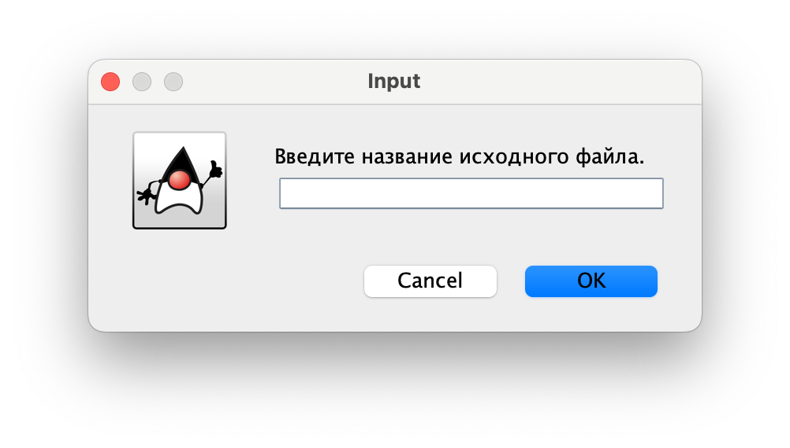
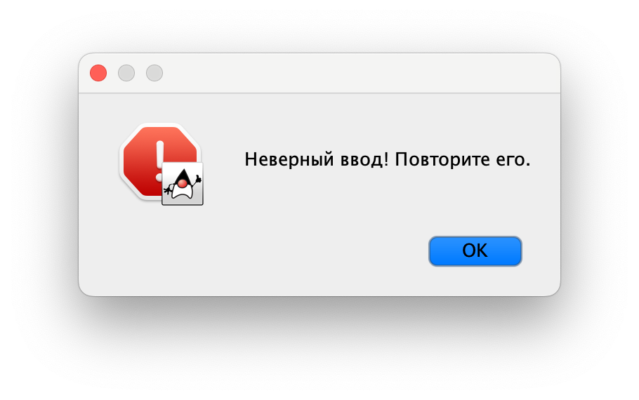

# ИДЗ №3 по курсу "Архитектура вычислительных систем"
## Тямин Илья Игоревич, БПИ-226
ОБ ИДЗ:
- Вариант №2
- Разработать программу,находящую в заданной ASCII–строке первую при обходе от конца к началу последовательность N символов, каждый элемент которой определяется по условию «больше предшествующего» (N вводится в качестве параметра). Понятие «больше предшествующего» определяется в соответствии с порядком следования символов от начала строки.
- Работа выполнена на 10 баллов

[Ссылка на папку с кодом на ассемблере](/code)

## О структуре программы

Вся программа логически поделена на несколько частей:
- [Основная программа](/code/main.asm). Из основной программы запускаются все реализованные макросы и подпрограммы, происходит управление регистрами.
- [Макробиблиотека](/code/macrolib.asm). В отличие от предыдущих ИДЗ, в данном ДЗ макробиблиотека была дополнена множеством новых макросов, которые мы подробнее рассмотрим позже.
- Файлы подпрограмм. Я разбил подпрограммы на несколько файлов с целью декомпозиции кода:
    - [Подпрограмма чтения и записи в память файла](/code/subprogram_openRead.asm). Данная подпрограмма открывает файл, читает его пакетами по 512, закрывает файл.
    - [Подпрограмма обработки данных](/code/subprogram_hander.asm). Подпрограмма реализует задание, соответствующее варианту №2
    - [Подпрограмма записи текста в файл](/code/subprogram_writer.asm). Программа записывает текст из буфера в файл.
    - [Другие подпрограммы](/code/subprogram_other.asm). В данном файле находятся еще две нужные для корректной работы общей программы функции - strlen и strcmp (их имитация, аналогичной представленной в C / C++).
- [Тестовые подпрограммы](/code/tester.asm). Здесь находятся две реализованные тестовые подпрограммы (с помощью макросов и с помощью подпрограмм). Чтобы включить тестовые(ую) подпрограммы(у), необходимо раскомментировать строку или строчки в начале основной программы (main.asm).

Также отдельно распологаются директории с тестовыми данными: [tests1](/code/tests1/) и [tests2](/code/tests2/), нужные для выполнения тестовых подпрограмм. 

## Кратко о коде
Так как код слишком большой (итого вышло чуть больше 500 строк), не буду помещать его в отчет целиком, лишь частями. Отдельно все файлы доступны по ссылкам выше.

Обзор кода разделен на 2 части: основная часть (по ходу алгоритма программы) и тестовые подпрограммы
### Основная часть
В начале файла распологается секция `.data` с нужными сообщениями, которые могут выводиться пользователю в ходе выполнения программы. 

В начале блока `.text`, если нужно включить тестовые подпрограммы, то нужно раскомментировать и/или строки `jal testing1`, `jal testing2`.

В самом начале также я реализовал оповещение пользователя о том, как нужно ему вводить пути до файлов (в зависимости от настроек RARS):


Затем, у пользователя запрашиваются путь до исходного файла и путь до файла, куда нужно будет сохранить результат. Запросы также производятся с помощью диалоговых окон Java.


За ввод файла отвечает специальный макрос:
```assembly
# Чтение строки с консоли / диалогового окна
.macro read_string_dialog(%message, %addr_buffer, %max_char_numb, %error)
	j get_str
	
	get_str:
	la a0 %message
	la a1 %addr_buffer
	li a2 %max_char_numb
	li a7 54
	ecall
	bne a1 zero not_correct
	j end
	
	not_correct:
	message_dialog(%error, 0)
	j get_str
	
	end:
.end_macro
```
Обратите внимание, в случае, если ввод некорректен, то пользователю будет показана ошибка, и ввод будет повторно запрошен.



Далее программа запрашивает у пользователя число $N$, требуемое в варианте. Также организована проверка на то, что число $N$  - неотрицательное. В случае некорректного ввода, число будет повторно затребовано. 

Затем, чтобы файлы корректно сохранялись и открывались, нам необходимо убрать символ переноса строки (`\n`) из путей к файлам, так как при вводе с консоли они автоматически добавляются. Для этого реализован специальный макрос `remove_newline`
```assembly
.macro remove_newline(%str)
	li t4 '\n'
	la t5 %str
	j loop_nl
	
	loop_nl:
	lb	t6  (t5)
	beq t4	t6 replace
	addi t5 t5 1
	j loop_nl
	
	replace:
    	sb zero (t5)
.end_macro
```
Данный макрос применяется к файлам откуда необходимо считывать и куда необходимо записывать.

После этого, программа открывает файл, передавая название входного файла и буфер в макрос `openFile`.

Реализация макроса `openFile`:
```assembly
.macro openFile(%nameOfTheInputFile, %text)
	la a0 %nameOfTheInputFile
	la a3 %text
	jal open_file
.end_macro
```

Рассмотрим подпрограмму `open_file`:
```assembly
.include "macrolib.asm"
.global open_file

.eqv PACKAGE_SIZE 512


.data
	err_openFile: .asciz "Ошибка открытия файла!"
	err_readFile: .asciz "Ошибка при чтении файла!"

.text
# В регистре a0 - имя открываемого файла
# В регистре a3 - буфер для текста (суммарный буфер)
# Возвращает в a4: 1 если удалось прочитать, 0 если не удалось
open_file:
	li   	a7 1024     	# Системный вызов открытия файла
    	li   	a1 0        	# Открыть для чтения (флаг = 0)
    	ecall             	# Дескриптор файла в a0 или -1)
    	li	s1 -1		# Проверка на корректное открытие
    	beq	a0 s1 er_name	# Ошибка открытия файла
    	mv s4 a0
    	j read_file_temp
    	
er_name:
	li a4 0
	message_dialog(err_openFile, 0)
	ret

read_file_temp:
	li   t0, 0 # количество считанных пакетов по 512
    	mv   a1 a3   # Адрес буфера для читаемого текста
    	li   a2 PACKAGE_SIZE # Размер читаемой порции
    	li t3 20
    	j read_file_loop
    	
   	read_file_loop:
   	mv a0 s4
   	beq t0 t3 end_read
   	li   a7, 63       # Системный вызов для чтения из файла
    	ecall             # Чтение
    	# Проверка на корректное чтение
    	beq  a0 s1 er_read	# Ошибка чтения
    	mv   s2 a0       	# Сохранение длины текста
    	beq s2 zero end_read
    	
    	addi a1 a1 PACKAGE_SIZE
    	addi t0 t0 1
    	j read_file_loop
    	
er_read:
	li a4 0
	message_dialog(err_readFile, 0)
	ret

end_read:
	# Нужно добавить ноль в конец строки (как конец)
	addi a1 a1 1
	sb zero(a1)
	# Файл нужно закрыть
	li   a7 57       # Системный вызов закрытия файла
	ecall             # Закрытие файла
	li a4 1
	ret

```
Согласно реализованному, подпрограмма сначала открывает файл (1024 системный вызов), сохраняя в `a0` дескриптор файла. В случае ошибки при открытии файла (например, если путь был неверно указан), программа не падает, а выводит осмысленную ошибку (диалоговое окно, аналогичное указанным выше) и выходит из подпрограммы:
```assembly
er_name:
	li a4 0
	message_dialog(err_openFile, 0)
	ret
```
Далее производится повторный запрос файла.

В случае, если файл открылся удачно, производится его чтение пакетами по 512 байт, но не более 10 Кб (проверка производится количеством считанных пакетов, итого их должно быть не более 20ти). Это ограничение обусловлено ограниченностью размера буфера. 

В конце файл нужно закрыть (системный вызов 57), перед этим добавив нуль-терминатор в конец строки.

Далее, следует основной блок программы: обработка полученного из файла текста. Для этого мы посчитаем длину введенного текста, используя макроопределение `strlen` (аналогично написанному на семинаре, можно посмотреть [тут](/code/subprogram_other.asm)). Это нужно для нахождения подстроки по заданию (такой, что каждый символ больше предыдущего). Для выполнения данной функции реализован макрос `findSubstr`. Его реализация:
```assembly
.macro findSubstr(%text, %N, %len_text_register)
	la a0 %text
	mv a1 %N 
	add a2 %len_text_register zero
	jal text_handler
.end_macro
```
Как видно, он в свою очередь вызывает подпрограмму `text_handler`. Она большая, поэтому прикреплю [ссылку на код](/code/subprogram_hander.asm). Входные данные: в регистре a0 текст, в регистре a1 - число N, в регистре a2 - кол-во символов в тексте. Выходные данные: в регистре a4 индекс начала последовательности, в регистре a5 индекс конца последовательности. *Если последовательность не найдена, то подпрограмма возвращает -1 -1*.

Реализация на ассемблере аналогична реализации на C++:
```cpp
std::pair<int, int> Task(std::string& str, int N) {
    int it = static_cast<int>(str.size()) - 1;
    int nakop = 1;
    for (int i = static_cast<int>(str.size()) - 2; i >= 0; --i) {
        if (str[i] < str[i+1]) {
            ++nakop;
            if (nakop == N) {
                return {i, it};
            }
        } else {
            it = i;
            nakop = 1;
        }
    }

    return {-1, -1};
}
```

Затем стоит задача создания новой строки, размер которой не известен на начало программы (так как определели только после text_handler). Поэтому я выделяю память в куче. Выделяю как минимум из 11 (так как если такой подстроки не нашлось, то я записываю в файл "NOT FOUND") и {длина строка + 2}. Для определения минимума также написан макрос `min_elem` - его реализацию можно глянуть в [макробиблиотеке](code/macrolib.asm). Затем программа выделяет нужное количество памяти в куче - реализован специальный макрос (возвращает в `a0` аллоцированную память):
```
.macro allocate_heap_memory(%N)
	mv a0 %N
	li a7 9
	ecall
.end_macro
```
После этого нужно эту строку заполнить :) и снова макрос :) в этот раз уже `createStringIdx`: 
```assembly
.macro createStringIdx(%memory, %idx1, %idx2, %text)
	mv a1 %memory
	mv a2 %idx1
	mv a3 %idx2
	la a4 %text
	jal create_str
.end_macro
```
Сам макрос вызывает подпрограмму `create_str`, ее реализация доступна [тут](code/subprogram_hander.asm).  В регистре a1 - буфер для текста, в a2, a3 - индексы, a4 - исходный текст Выход: a5 - количество записанных символов. 

Алгоритм таков: считываем символ `*(a4 + x)`, где $x \in [a2, a3]$. Сохраняем в новой памяти. Так пока не дойдем до конца. Если такой подпоследовательности нет (вернулось -1 -1), то записываем "NOT FOUND". 

Мы на финишной прямой: осталось записать все это в файл, введенный пользователем. Для этого был создан макрос `writeFile` и соответствующая подпрограмма `write_file`, распологаемая в этом [файле](code/subprogram_writer.asm):
```assembly
.include "macrolib.asm"
.global write_file

.text
# Входные данные: в регистре a0 - название файла (без \n в конце)
# в регистрах a2 - записываемая строка, в регистре a3 - ее длина
write_file:
	li a7 1024 # сделаем новый файл
	li a1 1 # разрешаем запись
	ecall # text decriptor находится сейчас в a0
	
	li a7 64 # запись в файл
	mv a1 a2
	mv a2 a3
	ecall
	
	# Закрыть файл
	li a7 57
	ecall
	
	ret

```
Создаем файл 1024 системным вызовом, разрешаем запись, записываем в файл 64 системным вызовом, закрываем файл. Profit!

Далее программа спрашивает необходимость выводить результат на экран (этот код находится в конце main):
```
# Спрашиваем у пользователя необходимость выводить результат в консоль
	read_string_dialog(message3, usersChoice, 3, incorrect_input)
	remove_newline(usersChoice)
	la a0 yes
	la a1 usersChoice
	jal strcmp
	beqz a0 pr_screen
	j to_exit
	
	pr_screen:
	mv a0 s4
	li a7 4
	ecall
	j to_exit
	
	to_exit:
	exit
```
Если пользователь ввел "Y", то выводим (это проверяет подпрограмма [strcmp](code/subprogram_other.asm) - она аналогична реализованной на семинаре), иначе выходим из программы.

### Тестовые программы
Согласно условию на 10 баллов, реализовано две тестовые подпрограммы: испольщующие реализованные макросы (которые в свою очередь используют подпрограммы) и использующие подпрограммы напрямую.

ВНИМАНИЕ!!! Для того, чтобы тестовые программы работали корректно, необходимо в RARS включить `Derive current working directory`.

[Файл с тестовыми подпрограммами](code/tester.asm).
Для тестирования также были реализованы специальные макросы: tester1 и tester2.

Для примера, приведу `tester2`:
```assembly
.macro tester2(%nameInput, %nameOutput, %text_testMem, %N)
	push(ra)
	openFile(%nameInput, %text_testMem)
	getStrlen(%text_testMem)
	
	findSubstr(%text_testMem, %N, a2)
	
	# Надо выделить в куче min(11, N + 2) байт
	li t0 11
	addi t1 %N 2
	min_elem(t0, t1) # вернет в t0 минимальный элемент (11, N + 2)
	mv s6 t0 # в s6 хранится кол-во аллоцированной памяти
	allocate_heap_memory(t0) # вернуло в a0 адрес на аллоцированную память
	mv s4 a0 # указатель на аллоцированную память
	
	createStringIdx(s4, a4, a5, %text_testMem)
	
	writeFile(%nameOutput, s4, s6)
	
	print_string("Тест из тестирования №2 пройден успешно!\n")
	pop(ra)
.end_macro
```
Реализация `tester1` аналогична, только с использованием подпрограмм.

В качестве тестовых кейсов использовались следующие входные данные:
- [1.in](code/tests1/1.in). Последовательность средней длины. Решение имеется при N = 5
- [2.in](code/tests1/2.in). Последовательность средней длины. Решение не имеется при N = 10
- [3.in](code/tests1/3.in). Последовательность максимальной длины (10 кб). Решение не имеется при N = 22
- [4.in](code/tests1/4.in). Пустой файл. решение не имеется при N = 10
- [5.in](code/tests1/5.in). Последовательность малой длины. Решение имеется при N = 3.

Эталонные ответы имеются в папке [answer_on_tests](code/answers_on_tests). Корректность можно проверить, используя написанный код на C++. 

По мере прохождения тестов в консоль выводится сообщение об успешном прохождении теста. 


Файлы записываются в формате $i.out$, где $i$ - номер теста в соответствующую директорию. Например, для первого теста - выходной файл $1.out$. 

Так, тестовая подпрограмма №1 сохраняет результаты в директорию `tests1`, а №2 в `tests2`. Тесты для обоих программ аналогичны и легко сравнить, что результаты выполнения совпадают.


## Тесты, демонстрирующие корректность работы разработанной программы
Корректность работы проверена выше в тестовых программах (рассмотрены все случаи). 

Дополнительно, покажу работу самой программы в формате .gif

Предварительно, в той же папке, что и код на ассемблере размещу файл `test.in`.
Его содержимое:
```
ABCDEFGKLMNOPRSTfdgshfgDGSHJGFJS
```
Работа программы:


## Критерии работы
Пройдемся по критериям:

- ⇒ Приведено решение программы на ассемблере. Программа из файла читает данные. Результаты записываются в другой файл. (4-5)
> Выполнено!
- ⇒ Все изменяемые параметры программы вводятся с консоли. (4-5)
> Выполнено! Только не с консоли, а с диалогового окна (на 10 баллов)
- ⇒ В программе присутствуют комментарии, поясняющие выполняемые ей действия. (4-5)
> Выполнено!
- ⇒ Обработка данных, полученных из файла сформирована в виде отдельной подпрограммы. (4-5)
> Выполнено! Все были описаны выше
- ⇒ В подкаталоге данных присутствуют файлы, используемые для тестирования. (4-5)
> Выполнено! Папки [tests1](code/tests1) и [tests2](code/tests2) для двух тестирующих программ
- ⇒ При чтении файла размером, превышающим размер буфера, не должно происходить падения программы. Программа должна корректно обработать введенный «урезанный» текст. (4-5)
> Выполнено! Просто недочитываем файл.
- ⇒ Сформирован отчет с результатами тестовых прогонов и описанием используемых опций компиляции, проведенных модификаций ассемблерной программы. (4-5)
> Выполнено! 
- ⇒ Внутри функций необходимо использовать регистровые или локальные (при нехватке) переменные. (6-7)
> Выполнено!
- ⇒ Для чтения текста из файла реализовать буфер ограниченного размера, равного 512 байтам. При этом программа должна читать файлы размером до 10 килобайт. (6-7)
> Выполнено! Алгоритм чтения описан в отчете.
- ⇒ Реализовать ввод исходных данных, их обработку, вывод результатов через соответствующие подпрограммы. Подпрограммы должны получать необходимые им данные через параметры в соответствии с принятым соглашением о передаче параметров. (6-7)
> Выполнено! Все подпрограммы описаны в отчете.
- ⇒ Возвращаемые из подпрограмм значения должны возвращаться через параметры в соответствии с общепринятыми соглашениями. (6-7)
> Выполнено! Были соблюдены все конвенции
- ⇒ Добавить в программу возможность дополнительного вывода результатов на консоль. Выводить или нет решает пользователь отвечая «Y» или «N» на соответствующий вопрос компьютерной программы. Данная возможность полезна при быстром отображении коротких данных. Вывод программы при этом должен полностью соответствовать выводу результатов в файл. (8)
> Выполнено! В конце main это было реализовано
- ⇒ Реализовать дополнительную тестовую программу, которая осуществляет многократный вызов процедур, обеспечивающих ввод файлов, их обработку и вывод для различных исходных данных, расположенных в каталоге с исходными тестовыми данными. (8)
> Выполнено! Тестовая программа №1
- ⇒ Добавить в программу использование макросов для реализации ввода, вывода, и обработки данных. Макросы должны поддерживать повторное использование с различными массивами и другими параметрами. Внутри макросов должны быть расположены вызовы соответствующих подпрограмм. (9)
> Выполнено! Их я и использую в основной программе
- ⇒ Программа должна быть разбита на несколько единиц компиляции. При этом подпрограммы ввода–вывода должны составлять унифицированные модули, используемые повторно как в программе, осуществляющей ввод исходных данных, так и в программе, осуществляющей тестовое покрытие. (10)
> Выполнено!
- ⇒ Макросы должны быть выделены в отдельную автономную библиотеку (10)
> Выполнено!
- ⇒ Использовать дополнительные графические диалоговые окна для ввода и отображения диалогов, предоставляемые симулятором RARS. (10)
> Выполнено! Описано в отчете.


## Бонус для проверяющего
