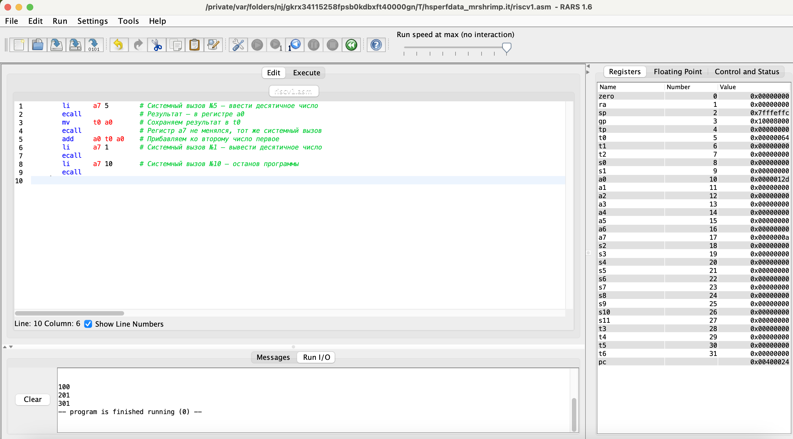
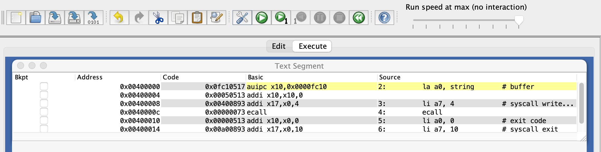
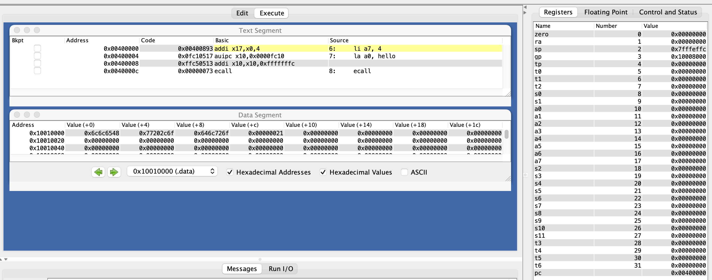
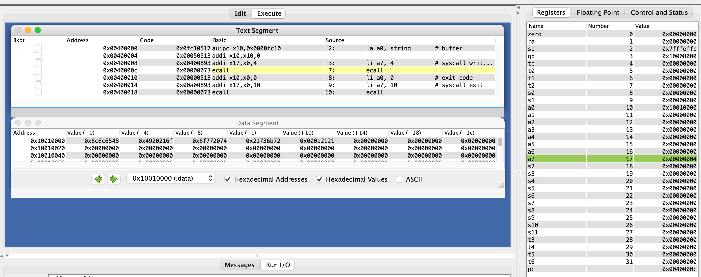
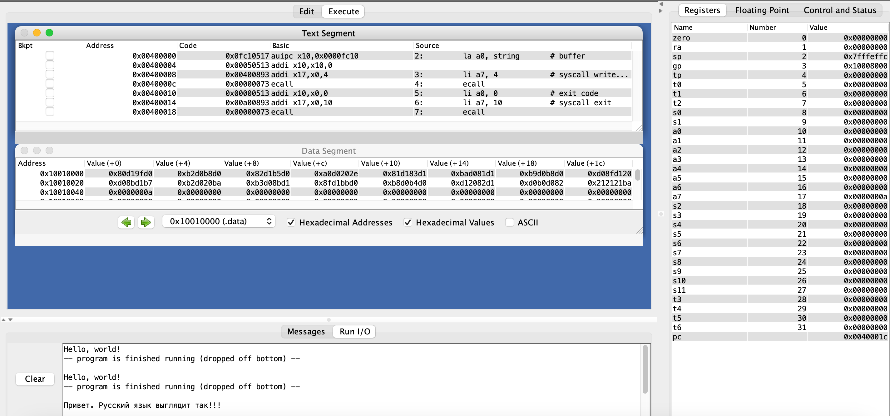
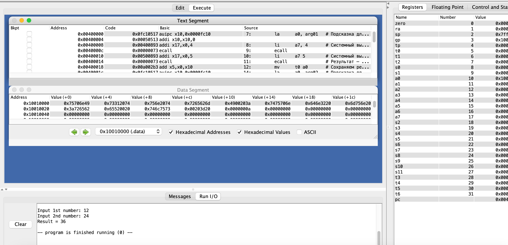

# АВС. Отчет по ДЗ №1. 
Тямин Илья БПИ226

## Задача №1. Add int

```assembly
        li      a7 5        # Системный вызов №5 — ввести десятичное число
        ecall               # Результат — в регистре a0
        mv      t0 a0       # Сохраняем результат в t0
        ecall               # Регистр a7 не менялся, тот же системный вызов
        add     a0 t0 a0    # Прибавляем ко второму число первое
        li      a7 1        # Системный вызов №1 — вывести десятичное число
        ecall
        li      a7 10       # Системный вызов №10 — останов программы
        ecall
        
```
Здесь используются системные вызовы:
1. №7 для ввода десятичного числа
2. №1 для выводы десятичного числа
3. №10 для остановки программы

Скриншот:



В регистр a7 кладем системный вызов №5. Затем с помощью ecall его вызываем, приравниваем t0 = a0 с помощью mv. Снова вызываем ecall для того же системного вызова. Затем с помощью add в строке 5 прибавляем ко второму число первое (a0 = a0 + t0). Аналогично, выводим на экран полученную сумму с помощью системного вызова №1.

## Задача №2. Hello-01
На данной задаче разберем псевдокоманды.
```assembly
.text
        la a0, string       # buffer
        li a7, 4            # syscall write (4)
        ecall
        li a0, 0            # exit code
        li a7, 10           # syscall exit
        ecall
.data
    string:  .asciz "Hello! It works!!!\n"

```

Программа выводит в консоль Hello, world! С помощью команды la мы заносим string в a0, вызываем системный вызов №7, вызываем системный вызов №10.

### Псевдокоманды
Псевдокомандами здесь являются:
1. la (load adress)

На примере: 
```
la a0, string
```
В регистр a0 помещает значение string. Так как складывает (addi, см скриншот ниже) string с нулевым регистром и помещает его соответственно в a0


2. li (load immediate)
На примере:
```
li a7, 4
```
Является псевдокомандой, так как загружает знач 4 в регистр a7, складывая 4 с нулевым регистром и помещая результат в регистр a7. 
Аналогично, на скриншоте выше li замещается на addi, поэтому является псевдокомандой

### Типы форматов команд
Здесь их нет, разберем дальше

### Системные вызовы
1. ecall
```
li a7, 4         
ecall
```
Выполняет системный вызов №4, ранее помещенный псевдокомандой li в регистр a7. Системный вызов №4 обозначает вывод строки на экран
```
li a7, 10           # syscall exit
ecall
```
Выполняет системный вызов №10, ранее помещенный псевдокомандой li в регистр a7. Системный вызов №10 обозначает выход из программы


## Задача №3. Hello-02
```
    .data
hello:
    .asciz "Hello, world!"
    .text
main:
    li a7, 4
    la a0, hello
    ecall

```
Программа выводит в консоль Hello, world! Примерно аналогична задаче 2.

Здесь фигурируют также ранее изученные псевдокоманды li и la, системный вызов №4. Только в данном случае программа разбита на директивы. Например, директива data состоит из asciz - строки, после последнего символа которой обязательно записывается нулевой байт. 

Скриншот из эмулятора:


## Задача №4. Hello-03
```
.text
        la a0, string       # buffer
        li a7, 4            # syscall write (4)
.data
    string:  .asciz "Hello! It works!!!\n"
.text
        ecall
        li a0, 0            # exit code
        li a7, 10           # syscall exit
        ecall

```

Скриншот из эмулятора:


Здесь показано, что директиву в коде можно делить на 2 и более частей, грубо говоря, ее дописывая. Сверху в директиве next мы выполняем команды la и li, занося строчку-asciz в регистр a0 и занося 4 в регистр a7, а снизу выполняя системный вызов №4 и выходя из программы. 

## Задача №5. Hello-03

```
.text
        la a0, string       # buffer
        li a7, 4            # syscall write (4)
        ecall
        li a0, 0            # exit code
        li a7, 10           # syscall exit
        ecall
.data
    string:  .asciz "Привет. Русский язык выглядит так!!!\n"

```
Кардинальных отличий от ранее описанного в задачах 3 и 4 нет

Скриншот из эмулятора:


## Задача №6. Hello-03
```
.data
    arg01:  .asciz "Input 1st number: "
    arg02:  .asciz "Input 2nd number: "
    result: .asciz "Result = "
    ln:     .asciz "\n"
.text
        la 	a0, arg01   # Подсказка для ввода первого числа
        li 	a7, 4       # Системный вызов №4
        ecall
        li      a7 5        # Системный вызов №5 — ввести десятичное число
        ecall               # Результат — в регистре a0
        mv      t0 a0       # Сохраняем результат в t0

        la 	a0, arg02   # Подсказка для ввода второго числа
        li 	a7, 4       # Системный вызов №4
        ecall
        li      a7 5        # Системный вызов №5 — ввести десятичное число
        ecall               # Результат — в регистре a0
        mv      t1 a0       # Сохраняем результат в t1

        la a0, result       # Подсказка для выводимого результата
        li a7, 4            # Системный вызов №4
        ecall
        add     a0 t0 t1    # Складываем два числа
        li      a7 1        # Системный вызов №1 — вывести десятичное число
        ecall

        la a0, ln           # Перевод строки
        li a7, 4            # Системный вызов №4
        ecall

        li      a7 10       # Системный вызов №10 — останов программы
        ecall

```

Скриншот из эмулятора:


### Псевдокоманды
Кроме ранее указанных псевдокоманд li и la здесь также еще присутствуют псевдокоманды mv (move), которая копирует значение из регистра а0 в t0. При этом происходит сложение с нулевым регистром из-за чего она является псевдокомандой.

### Типы форматов команд
1. add
```
add a0 t0 t1
```
add в регистр а0 добавляет сумму регистров t0 и а0. Это R-команда, так как в один регистр добавляет сумму других

### Системные вызовы
Кроме ранее описанных также появились еще системные вызовы №5 - ввести десятичное число, №1 - вывести десятичное число.


## Допзадание на 10 баллов
Ссылка на ролик: [https://youtu.be/-KhwlxbH-b0](https://youtu.be/-KhwlxbH-b0)