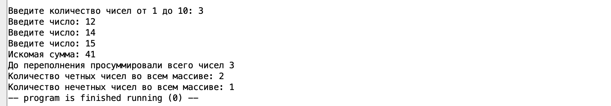
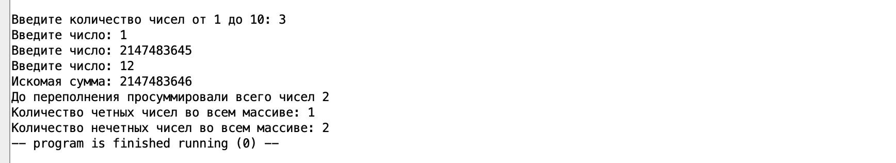
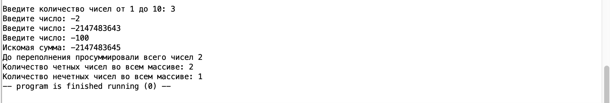
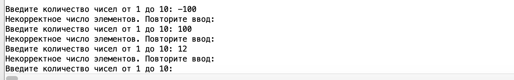
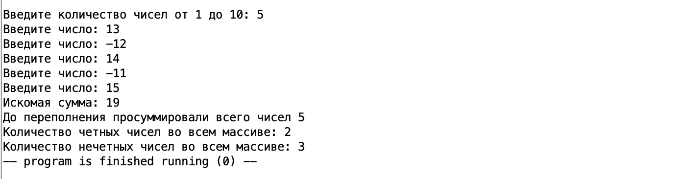

# АВС. Отчет по ДЗ №3. 
Тямин Илья БПИ226

## Код на ассемблере
Приведу сам код программы
```assembly
.data 
	input: .asciz "Введите количество чисел от 1 до 10: "
	not_correct_num: .asciz "Некорректное число элементов. Повторите ввод: \n"
	input_one_num: .asciz "Введите число: "
	result_sum: .asciz "Искомая сумма: "
	succesful_: .asciz "\nДо переполнения просуммировали всего чисел "
	odd_sum: .asciz "\nКоличество четных чисел во всем массиве: "
	even_sum: .asciz "\nКоличество нечетных чисел во всем массиве: "
	.align 2
	array:  .space  64
	arrend:


.text
	li s3 2147483647 # граница правая инта
	li s4 -2147483647 # граница левая инта
	la t0 array 
	la t1 arrend
	li t2 0
	j input_num_elements
	
	input_num_elements:
	# Запрашиваем число элементов
	li a7 4
	la a0 input
	ecall
	li a7 5
	ecall
	mv s1 a0 # регистр s1 = кол-во чисел
	j check_num_borders
	
	check_num_borders:
	li t3 1
	li t4 10
	blt a0 t3 not_correct_numb_elements
	bgt a0 t4 not_correct_numb_elements
	j input_nums
	
	not_correct_numb_elements:
	li a7 4
	la a0 not_correct_num
	ecall
	j input_num_elements
	
	input_nums:
	bgeu t2 s1 initial_sum
	li a7 4
	la a0 input_one_num
	ecall
	li a7 5
	ecall
	sw a0 (t0)
	addi t0 t0 4 # шаг вперед
	addi t2 t2 1
	j input_nums
	
	initial_sum:
	mv s2 zero # накопленная сумма
	mv s9 zero # количество удавшихся в просуммировании чисел
	la t0 array
	li t2 0
	j sum
	
	sum:
	bge t2 s1 count_odd_even_init
	addi t2 t2 1
	j check_overflow
	
	
	check_overflow:
	lw t4 (t0) # в регистр t4 грузим текущее число
	beqz s2 plus
	bgez s2 check_overflow_plus
	bltz s2 check_overflow_minus
		check_overflow_plus:
		sub t3 s3 s2 # порог(+) - им сумма
		bge t3 t4 plus
		j sum
		
		check_overflow_minus:
		sub t3 s4 s2 # порог(-) - им разность
		ble t3 t4 plus
		j sum
	
		plus:
		add s2 s2 t4
		addi s9 s9 1
		addi t0 t0 4
		j sum
		
	
	count_odd_even_init:
	la t0 array
	li t2 0
	li s10 0 # количество четных чисел
	li s11 0 # количество нечетных чисел
	j count_odd_even
	
	count_odd_even:
	bge t2 s1 output
	addi t2 t2 1
	j check_odd_even
	
	check_odd_even:
	lw t4 (t0) # в регистр t4 грузим текущее число
	li t5 2
	bltz s2 check_odd_even_minus
	j check_odd_even_sum
		check_odd_even_minus:
		neg t4 t4
		j check_odd_even_sum
	
		check_odd_even_sum:
		rem t4 t4 t5
		addi t0 t0 4
		beqz t4 check_odd_sum
		bnez t4 check_even_sum
		
		check_odd_sum:
		addi s10 s10 1
		j count_odd_even
		
		check_even_sum:
		addi s11 s11 1
		j count_odd_even
		
	output:
	li a7 4
	la a0 result_sum
	ecall
	mv a0 s2
	li a7 1
	ecall
	
	li a7 4
	la a0 succesful_
	ecall
	mv a0 s9
	li a7 1
	ecall
	
	li a7 4
	la a0 odd_sum
	ecall
	li a7 1
	mv a0 s10
	ecall
	
	li a7 4
	la a0 even_sum
	ecall
	li a7 1
	mv a0 s11
	ecall
	
	li a7 10
	ecall
	
```
## Описание работа кода
0. В блоке $data$ выделяем память под массив. Кроме того, размещаем там необходимые строки
1.  Cначала мы запрашиваем число элементов $N$. Проверяем его на корректность: если оно не входит в диапазон [1;10], тогда повторяем шаг 1 до того момента, пока пользователь не введет корректное число.

2. Запрашиваем $N$ чисел. Размещаем их в памяти с помощью команды $sw$. 

3. Проходимся циклов по сохранненному массиву. Поэтапно суммируем элементы, при этом проверяем, что сумма не будет переполнена. Тактика проверки: 
$$
Порог_+ - им.сумма \geq \ новое \ число
$$ 
если число положительное
$$
Порог_- + им.сумма \leq новое \ число
$$ 
если число отрицательное 

Если проверка прошла, то мы прибавляем к сумме это число, увеличиваем счетчик удавшихся операций на 1, увеличиваем счетчик общих операций на 1 (цикл for). 

4. Подсчет четных / нечетных чисел
После того, как мы нашли сумму. Вместо каждого числа кладем его остаток от деления на 2. Если он равен 0, число четное, увеличиваем счетчик четных на 1, иначе нечетное, соответственно, увеличиваем счетчик нечетных на 1.


## Всевозможные кейсы
### Случай №1. Обычный кейс без переполнения


### Случай №2. Положительное переполнение 


### Случай №3. Отрицательное переполнение


### Случай №4. Неверное кол-во чисел


### Случай №5. Без переполнения, но числа как +, так и -



## Вывод
Таким образом, мы рассмотрели всевозможные комбинации тестового покрытия. Программа работает корректно, не завершает свою работу при каких-либо корректных входных данных, все случаи описаны. Доп задание на 10 баллов также выполнил.
