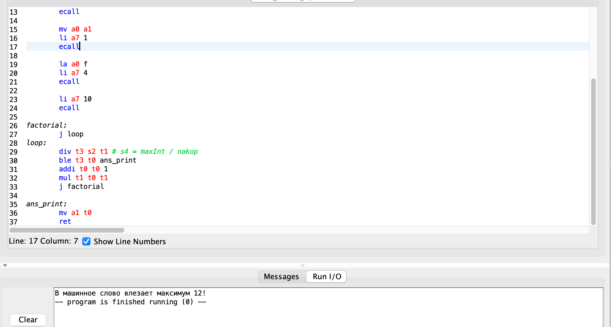
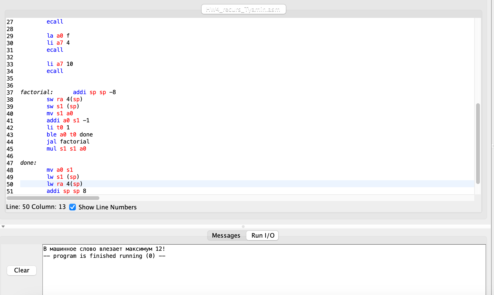

# АВС. Отчет по ДЗ №4. 
Тямин Илья БПИ226

## Код на 8 баллов
```assembly
.data
	ans: .asciz "В машинное слово влезает максимум "
	f: .asciz "!"
	
.text
	li s2 2147483647 # s2 -> maxInt
	li t0 1 # i = 1
	li t1 1 # s4 = nakop = 1
	jal factorial # вызов подпрограммы
	
	la a0 ans # Выводим на экран значения
	li a7 4 
	ecall
	
	mv a0 a1 
	li a7 1
	ecall
	
	la a0 f
	li a7 4
	ecall
	
	li a7 10
	ecall
	
factorial:
	j loop # цикл
loop:
	div t3 s2 t1 # t3 = maxInt / nakop
	ble t3 t0 ans_print # если t3 <= t0 -> в метку
	addi t0 t0 1 # t0 += 1
	mul t1 t0 t1 # прибавляем накоп
	j factorial
	
ans_print:
	mv a1 t0
	ret
```


## Описание кода на 8 баллов
Программа реализована в виде цикла. Сохраняем в s2 максимальное значение int-а. Регистр t0 отвечает за значение, от которого считается факториал. t1 и есть значение факториала. 

Вызываем подпрограмму с помощью jal. Сама подпрограмма - цикл, выполняющийся до того как maxInt / накоп <= i. Как только это условие выполняется мы размещаем значение i в a1 (регистр для возврата значений) и с помощью ret возвращаем его. Сам цикл реализован так: t0 += 1, умножаем накоп t1 = t0*t1.

Ответ: в машинное слово вмещается 12!


## Код на 10 баллов через рекурсию
```assembly
.data
	ans: .asciz "В машинное слово влезает максимум "
	f: .asciz "!"
	
.text
	li s2 2147483647 # s2 -> maxInt
	li s10 1 # i = 1
	li t1 1 # s4 = nakop = 1
	li a0 1 #start number
	j count_word
	
count_word:
	mv a0 s10
	jal factorial # факториал для значения = 1, возвращает в a0
	div t3 s2 s10 # s4 = maxInt / i
	ble t3 a0 ans_print # если выполняется, печатаем ответ
	addi s10 s10 1 # увеличиваем знач факториала
	j count_word # цикл
	
ans_print:
	la a0 ans
	li a7 4
	ecall
	
	mv a0 s10
	li a7 1
	ecall
	
	la a0 f
	li a7 4
	ecall
	
	li a7 10
	ecall

	
factorial:	addi sp sp -8 # резервируем на стеке память
	sw ra 4(sp) # добавляем
	sw s1 (sp)
	mv s1 a0
	addi a0 s1 -1
	li t0 1
	ble a0 t0 done # знач == 1 -> выполнили все
	jal factorial # рекурсивный вызов
	mul s1 s1 a0

done:
	mv a0 s1 # сохраняем в a0 значение
	lw s1 (sp) # восстанавливаем s1
	lw ra 4(sp) # восстанавливаем ra
	addi sp sp 8 # восстанавливаем стек
	ret

```


## Описание кода на 10 баллов
Программа реализована с рекурсивной реализацией факториала, соответствующего формуле $$f(i) = f(i-1)*i$$
Аналогично программе на 8 баллов сохраняем максимальное значение инта, текущее i, для которого считается факториал, значение факториала. Перебираем i и для каждого считаем рекурсивно факториал. Если maxInt / i <= factorial(i) -> произошло переполнение. Иначе увеличиваем i и проделываем ту же процедуру но для нового значения i.

Как считается рекурсивно факториал: добавляем согласно конвенции в стек значения ra, s1. Рекурсивно уменьшаем значение аргумента. Когда оно достигает 1, переходим в метку done, восстанавливаем значения, в a0 сохраняем получившееся значение и возвращаемся из подпрограммы. Иначе продолжаем рекурсивный вызов. 

Ответ аналогичен коду на 8 баллов: в машинное слово вмещается 12!
