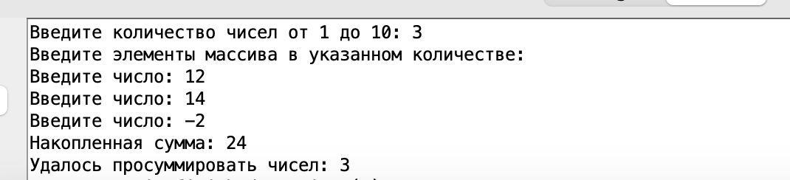
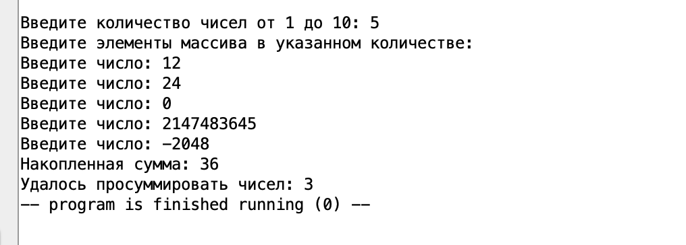
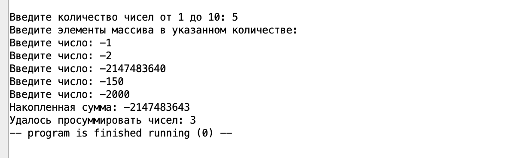
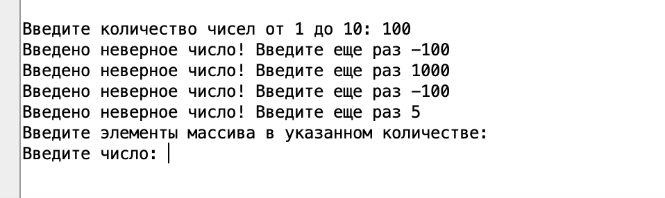
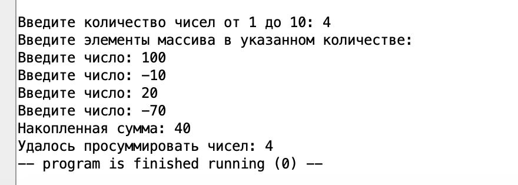

# АВС. Отчет по ДЗ №5. 
Тямин Илья БПИ226 

**Работа выполнена на 8 баллов**

## Код на 8 баллов
__Код удобнее смотреть в прикрепленной папке code__

Файл основной программы ""
```assembly

.include "macrolib.asm"

.data
	.align 2
	array:  .space  64
	arrend:

.global main
	.text
	
main:
	print_string("Введите количество чисел от 1 до 10: ")
	jal input_num_elements
	
	print_string("Введите элементы массива в указанном количестве: \n")
	la t5 array # t5 - место для массива
	li t2 0 # t2 - кол-во накопленных чисел
	jal input_nums
	
	la t5 array # t5 - место для массива
	li s3 2147483647 # граница правая инта
	li s4 -2147483647 # граница левая инта
	jal initial_sum
	
	jal data_output
	
	li a7 10
	ecall

```

Файл макробиблиотеки "macrolib.asm"
```assembly
#
# Example library of macros.
#

# Печать целого числа x
.macro print_int (%x)
	li a7, 1
	mv a0, %x
	ecall
.end_macro

# Печать целого числа x
.macro print_imm_int (%x)
    li a7, 1
    li a0, %x
    ecall
.end_macro

# Ввод целого числа с консоли в регистр a0
.macro read_int_a0
   li a7, 5
   ecall
.end_macro

# Ввод целого числа с консоли в указанный регистр, НО НЕ a0
.macro read_int(%x)
   push	(a0)
   li a7, 5
   ecall
   mv %x, a0
   pop	(a0)
.end_macro

# Печать строки x
   .macro print_string (%x)
   .data
str:
   .asciz %x
   .text
   push (a0)
   li a7, 4
   la a0, str
   ecall
   pop	(a0)
   .end_macro

# Печать символа x
   .macro print_char(%x)
   li a7, 11
   li a0, %x
   ecall
   .end_macro

   .macro newline
   print_char('\n')
   .end_macro

# Завершение программы
.macro exit
    li a7, 10
    ecall
.end_macro

# Сохранение заданного регистра на стеке
.macro push(%x)
	addi	sp, sp, -4
	sw	%x, (sp)
.end_macro

# Выталкивание значения с вершины стека в регистр
.macro pop(%x)
	lw	%x, (sp)
	addi	sp, sp, 4
.end_macro

```

Файл с подпрограммами "macrolib.asm"
```
.include "macrolib.asm"

.global input_num_elements, input_nums, initial_sum, data_output
	.text

input_num_elements:
.text
# Запрашиваем число элементов
	read_int_a0
	mv t0 a0 # регистр t0 = кол-во чисел
	j check_num_borders
	
	check_num_borders:
	li t3 1 # левая граница допустимого N
	li t4 10 # правая граница допустимого N
	blt a0 t3 not_correct_numb_elements
	bgt a0 t4 not_correct_numb_elements
	ret
	
	not_correct_numb_elements:
	print_string("Введено неверное число! Введите еще раз ")
	j input_num_elements
	
input_nums:
	bgeu t2 t0 all_is_input
	print_string("Введите число: ")
	read_int_a0
	sw a0 (t5)
	addi t5 t5 4 # шаг вперед
	addi t2 t2 1
	j input_nums
	
	all_is_input:
	ret


initial_sum:
	mv t1 zero # накопленная сумма
	mv t2 zero 
	li t6 0 # количество удавшихся в просуммировании чисел
	j sum
	
	sum:
	bge t2 t0 initial_sum_ret
	addi t2 t2 1
	j check_overflow
	
	
	check_overflow:
	lw t4 (t5) # в регистр t4 грузим текущее число
	beqz t1 plus
	bgez t1 check_overflow_plus
	bltz t1 check_overflow_minus
		check_overflow_plus:
		sub t3 s3 t1 # порог(+) - им сумма
		bge t3 t4 plus
		j sum
		
		check_overflow_minus:
		sub t3 s4 t1 # порог(-) - им разность
		ble t3 t4 plus
		j sum
	
		plus:
		add t1 t1 t4
		addi t6 t6 1
		addi t5 t5 4
		j sum
		
	initial_sum_ret:
		ret
		
data_output:
	print_string("Накопленная сумма: ")
	print_int(t1)
	newline
	print_string("Удалось просуммировать чисел: ")
	print_int(t6)
	ret
```


## Описание кода
Сама программа, согласно условию, разделена на 3 файла:
- файл основной программы (programm.asm)
- файл макробиблиотеки с вспомогательными макросами: распечатать число, строку, перевести консоль на новую строку (macrolib.asm)
- файл с вспомогательными подпрограммами: ввод массива, обработка массива. (subprogramms.asm)


### Файл основной программы:
- Подключаем макробиблиотеку с помощью директивы include
- Выделяем память под массив с помощью align
- Объявляем метку $main$ глобальной с помощью global.
- В основной программе печатаем строки, используя макрос из подключенной макробиблиотеки, а также вызываем подпрограммы с помощью jal.
- Программа соблюдает все конвенции, рассмотренные на семинаре для подпрограмм: регистры типа s остаются неизменными, регистры типа t подпрограмма может изменять

### Файл макробиблиотеки:
Стандартен, соответствует тому, что было рассмотрено на семинаре.

### Файл с доппрограммами:
- Подключаем макробиблиотеку с помощью include
- Объявляем метки input_num_elements, input_nums, initial_sum, data_output глобальными, чтобы их можно было использовать в основной программе без лишних подключений
- В остальном код доппрограмм аналогичен домашнему заданию №3:
  -  Cначала мы запрашиваем число элементов $N$. Проверяем его на корректность: если оно не входит в диапазон [1;10], тогда повторяем шаг 1 до того момента, пока пользователь не введет корректное число.

  - Запрашиваем $N$ чисел. Размещаем их в памяти с помощью команды $sw$. 

  - Проходимся циклов по сохранненному массиву. Поэтапно суммируем элементы, при этом проверяем, что сумма не будет переполнена. Тактика проверки: 
$$
Порог_+ - им.сумма \geq \ новое \ число
$$ 
если число положительное
$$
Порог_- + им.сумма \leq новое \ число
$$ 
если число отрицательное 

Если проверка прошла, то мы прибавляем к сумме это число, увеличиваем счетчик удавшихся операций на 1, увеличиваем счетчик общих операций на 1 (цикл for). 

## Всевозможные кейсы
### Случай №1. Обычный кейс без переполнения


### Случай №2. Положительное переполнение 


### Случай №3. Отрицательное переполнение


### Случай №4. Неверное кол-во чисел


### Случай №5. Без переполнения, но числа как +, так и -



## Вывод
Была написана программа на 8 баллов, разделенная на макробиблиотеку и файл с подпрограммами. Программа работает корректно на всем тестовом покрытии, результаты тестового покрытия приведены выше. 

