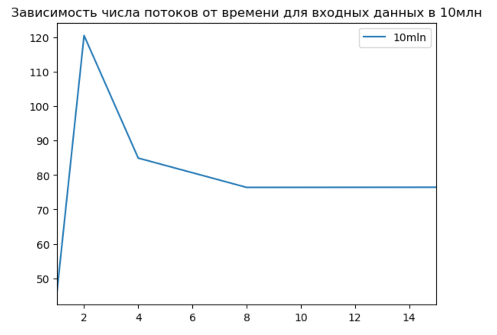
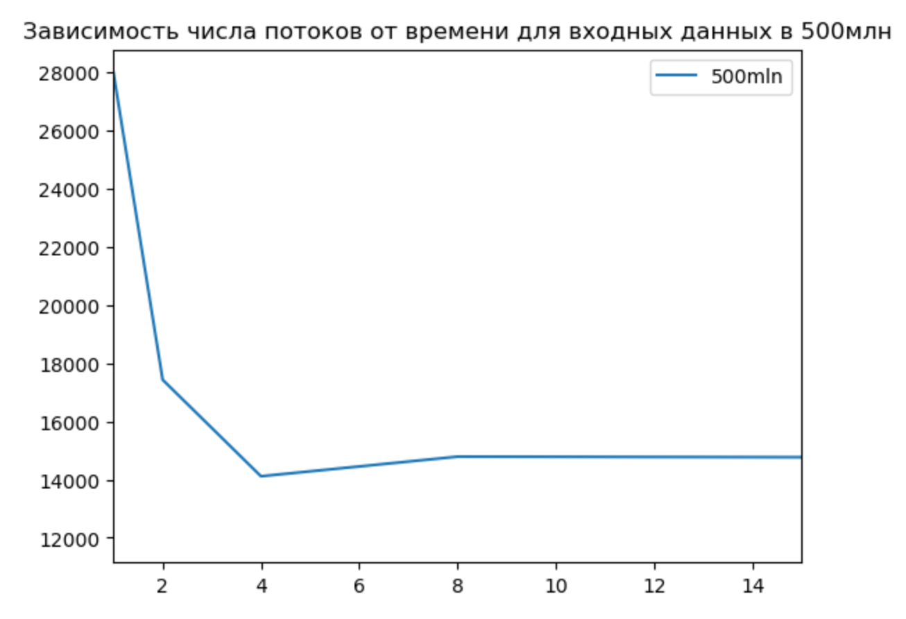
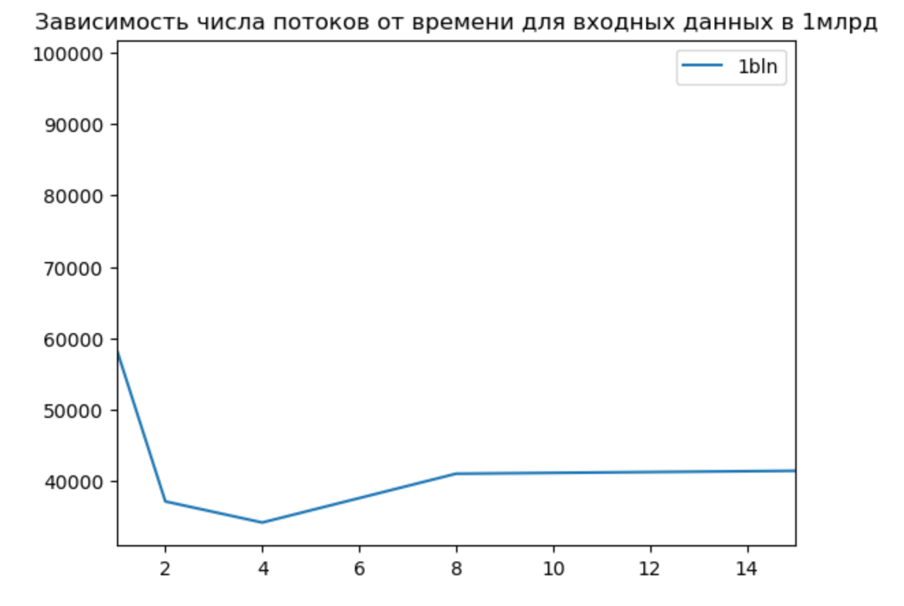
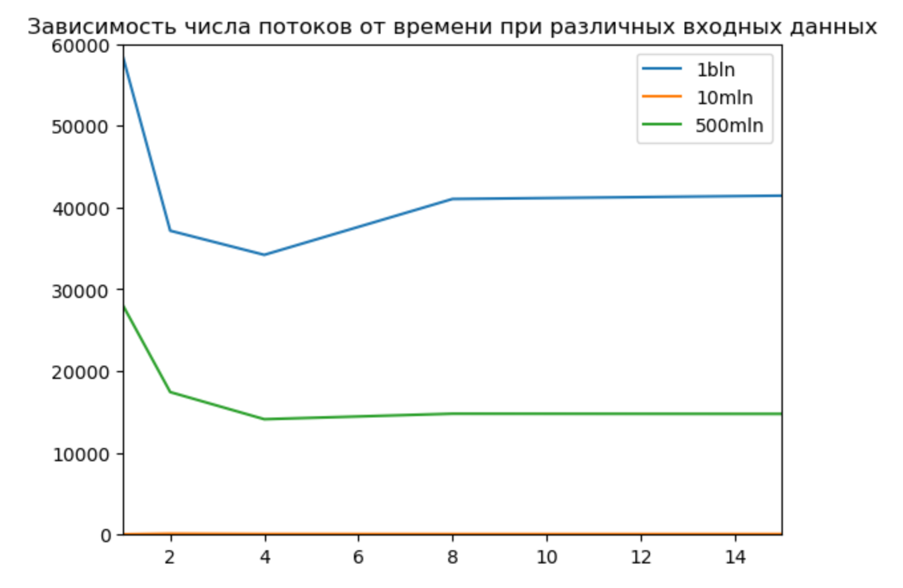

# АВС. Отчет по ДЗ №8. 
## Тямин Илья БПИ226 

Задание (резюмируя):
1. Разработать программу для вычисления скалярного произведения двух векторов $A$ и $B$, используя один поток и много потоков (на 10 баллов рассмотреть случаи 1, 2, 4, 8, 1000).
2. Протестировать эту программу на исходных данных размеров 10'000'000 (10 миллионов), 500'000'000 (500 миллионов), 1'000'000'000 (1 миллиард).
> Внимание! В условии сказано, что надо использовать размер в 100 миллиардов, но мой компьютер начал отказывать уже при 1 миллиарде, так что получилось только так.
3. Сравнить значения этих исходных данных на различном числе указанных потоков. Сформировать таблицы. 
4. На 10 баллов дополнительно сделать выводы про своппинг и резкое замедление работы программы.


**Работа выполнена на 10 баллов**

## Код программы на C++ 
Код удобнее смотреть в папке [code_cpp](code_cpp/).

Все результаты тестовых прогонов программой сохраняются в файл [data.txt](data.txt) в формате: КОЛ_ВО_ДАННЫХ;КОЛ_ВО_ПОТОКОВ;ВРЕМЯ_В_МС

Визуально программа разбита на 2 `.cpp` файла:
### `main.cpp`
Содержащий:
- генерацию исходных массивов указанной длины в динамической памяти, согласно требуемым условиям
- Тестирование с помощью одного потока, для этого написан элементарный метод `ScalarProduct(double A[], double B[], int N)`. Само тестирование производится методом `TestWithoutThreads(double A[], double B[], int N)`, который открывает файл `data.txt` для повторной записи (для этого использую std::ios::app), замеряет время работы программы с помощью библиотеки `chrono` в C++, записывает результаты в заранее оговоренном формате.
- Вызов тестирования для $N$ потоков с помощью метода `TestWithThreads(A, B, size, threadSize)`, где $N \in \{ 2, 4, 8, 1000 \}$. Работа данного метода рассмотрена ниже.

Также стоит отметить, что `main.cpp` делает указанные выше процедуры для тестовых данных трех размеров: 10 миллионов, 500 миллионов и 1 миллиард. Память, выделенная в динамической памяти, чистится после завершения работы с этими исходными данными.

### `testWithThreads.cpp`
В данном файле расположено все, что нужно для многопоточной версии скалярного произведения.
1. Реализация структуры `ThreadPackage`, которая в себе хранит:
	- указатели на два массива в динамической памяти
	- номер выполняемого потока
	- общее количество потоков: `threadsNum`
	- количество элементов ($N$)
	- поле `sum` для частично формируемой суммы

```cpp
struct ThreadPackage {
    double *array1;
    double *array2;
    int threadNum;  // Номер потока
    int allThreads;
    int N; // кол-во элементов
    double sum;     // Формируемая частичная сумма
};
```

2. Метод `void *startFunc(void *package)`, являющийся стартовым методом для потоков. Принимает указатель на ThreadPackage, который заcast-чен к `void*`, отдает nullptr.

Реализация его простая: весь массив делится на threadsNum частей, каждый из потоков выполняет суммирование $i$-й части. Например, данных всего 100, а потоков 4: значит, поток №0 выполняет суммирование с 0 по 25 невключительно, №1 - с 25 по 50, №2 - с 50 по 75, №3 - с 75 по 100.

Результат суммирования записывается в поле `sum` объекта `ThreadPackage`.

```cpp
void *startFunc(void *package) {
    auto *pack = (ThreadPackage *) package;
    pack->sum = 0.0;
    for (int startCounter = (pack->N / pack->allThreads) * pack->threadNum; startCounter < (pack->N / pack->allThreads) * (pack->threadNum+1); ++startCounter) {
        pack->sum += pack->array1[startCounter] * pack->array2[startCounter];
    }
    return nullptr;
}
```

3. Основная функция `void TestWithThreads(double A[], double B[], int N, int threadsNum)`.

Первоочередно, она создает массив из threadsNum потоков и из threadsNum объектов типа ThreadPackage. Затем в цикле, который выполняется threadsNum раз происходит инициализация полей объекта ThreadPackage и создание $i$-го потока
```cpp
pthread_create(&threads[i], nullptr, startFunc, (void *) &threadPackages[i]);
```
После этого нам нужно все потоки заjoin-ить и посчитать итоговую сумму:
```cpp
for (int i = 0; i < threadsNum; ++i) {
        pthread_join(threads[i], nullptr);
        resultSum += threadPackages[i].sum;
    }
```
Далее происходит запись в файл в оговоренном выше формате.

## Анализ полученных данных
Если интересно, графики были получены, используя Python, вот [ссылка на колаб-ноутбук](draw_statistics.ipynb)

|   dataLen |   threadsCount |    time |
|----------:|---------------:|--------:|
|     10'000'000 |              1 |  46.06  |
|     10'000'000 |              2 | 120.531 |
|     10'000'000 |              4 |  84.923 |
|     10'000'000 |              8 |  76.411 |
|     10'000'000 |           1000 |  82.083 |



Как видно, использовать многопоточную программу для данной задачи при входных данных в 10 миллионов не совсем верное решение, так как при 1-м потоке время работы меньше, чем при любом другом рассмотренном количестве потоков. Значит, многопоточное исполнение будет являться ликвидным при гораздо большем размере входных данных.


|   dataLen |   threadsCount |    time |
|----------:|---------------:|--------:|
|     500'000'000 |              1 | 27988.4 |
|     500'000'000 |              2 | 17431.8 |
|     500'000'000 |              4 | 14112.5 |
|     500'000'000 |              8 | 14786.9 |
|     500'000'000 |           1000 | 11948.6 |



При размере входных данных в 500 миллионов чисел многопоточная реализация метода подсчета является уже выгодным решением. Как видно, реализация программы с использованием 2х, 4х, 8х и 1000-ти потоков работает быстрее, чем нативная реализация с 1м потоком. 

Также можно сделать вывод (по графику и таблице), что оптимальным количеством потоков является 4 и 8.

|   dataLen |   threadsCount |    time |
|----------:|---------------:|--------:|
|     1'000'000'000 |              1 | 58347.4 |
|     1'000'000'000 |              2 | 37168.7 |
|     1'000'000'000 |              4 | 34216.9 |
|     1'000'000'000 |              8 | 41048.9 |
|     1'000'000'000 |           1000 | 98533.6 |



При размере входных данных в 1 миллиард чисел, логично, что нативная реализация работает хуже, чем многопоточное исполнение. Однако тут стоит отметить, что многопоточная реализация работает быстрее при количестве потоков, равным 2, 4, 8 (оптимальным же является число в 4 потока). Реализация на 1000 потоках является крайне неоптимальной, возможной гипотезой почему данные распределились именно так является количество ядер на компьютере: исследование производилось на 4х ядерном компьютере, поэтому системе легко задействовать 4 ядра, а реализация в 1000 ядер будет соответствовать поочередному выделению мощностей процессора.

К сожалению, компьютер, на котором проводилось исследование, еле выдержал нагрузку в 1 миллиард чисел, так что протестировать гипотезу на более большом количестве исходных данных не представляется возможным.

## Сравним и сделаем выводы
Исходя из вышеуказанных данных, можно сказать, что (по крайней мере для 4х ядерного компьютера) оптимальным является использование 4х потоков.

Посмотрим на общую диаграмму "кол-во потоков / время" для всех тестовых данных:



Несмотря на то, что сложность алгоритма - $O(n)$, то есть с увеличением входных данных время выполнения должно расти линейно, при увеличении размера входных данных в 50 раз с 10 миллионов до 500та миллионов, время выполнения программы увеличилось примерно в 145 раз. При этом построенный график свидетельствует о том, что при увеличении размера данных с 500 миллионов до 1 миллиарда время увеличилось вполне линейно: в 2 раза.

Это свидетельствует о том, что для размера данных в **500'000'000** чисел произошел **своппинг** - это процесс выгрузки редко используемых областей виртуального адресного пространства программы и/или всей программы на диск или другое устройство внешней памяти. Такая внешняя память всегда намного дешевле оперативной памяти, хотя и намного медленнее. **Своппинг также происходит и для 1 миллиарда чисел, иначе время не возросло бы линейно.**

Своппинг может происходить из-за того, что мы также используем `double`: в памяти он хранится как 8 байт. Два массива размера в 500'000'000 чисел занимают в памяти примерно:
$$
\frac{500'000'000 * 2}{1024*1024} = 953 Мб
$$
Для 1 миллиарда чисел:
$$
\frac{1'000'000'000 * 2}{1024*1024} = 1907 Мб
$$
ОС не выгодно хранить так много памяти в оперативной памяти, учитывая, что это не единственный для нее процесс, поэтому происходит своппинг.

## Бонус!
Я реанимирую ноутбук после 10 миллиардов чисел:

