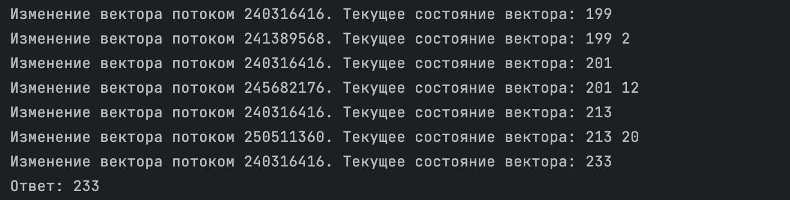

# АВС. Отчет по ДЗ №9. 
## Тямин Илья БПИ226 

Задание (резюмируя):
- Разработать программу, используя библиотеку POSIX tрreads, которая обеспечивает выполнение асинхронных параллельных вычислений по описанной схеме. Для понимания происходящих в системе событий и процессов необходимо сформировать вывод в консоль протокола, в котором подробно фиксируются выполняемые программой действия, описывающие продвижение данных, получение промежуточных результатов, состояние поступивших в буфер необработанных данных. Форма протокола свободная, но понятная для чтения.

**Работа выполнена на 10 баллов**

## О коде (C++)
Программа выполнена на C++ и насыщена комментариями. Кратко опишу происходящее здесь, а так код можно посмотреть в данной [папке](code/).

- функция main() в файле [main.cpp](code/main.cpp), вызывающая метод решения задачи и печатающая результат ее выполнения.
- файл [task_threads.cpp](code/task_threads.cpp), содержащий всю основную логику программы:
    - в методе `SolveTheTask()` инициализируется мьютекс для его дальнейшего использования в потоках. Также инициализируются 20 потоков (и вызываются). Их стартовая функция - `MakeTheNumber`, она будет описана позже. Тут же потоки закрываются
    - в методе `void* MakeTheNumber(void* args)` происходит основная реализация многопоточного исполнения алгоритма. Сначала генерируется случайное число (генераторы описаны в начале файла) и случайное время задержки. Затем мьютекс блокирует часть кода, в котором добавляется элемент в вектор, и если их там два, то создается еще один поток, в котором суммируется эти два значения. Затем мьютекст разблокируется.
    - метод `void* SumTwoNum(void* args)` является стартовой функцией для как раз таки создающегося потока суммирования. Здесь все просто - берутся два числа с вектора, вектор очищается, добавляется сумма.
    - метод ` void Log(_opaque_pthread_t*  threadId)` нужен для удобного логгирования происходящего  - вывода на консоль изменений в векторе. Принимает "id" потока

[Еще раз реализация лежит тут](code/task_threads.cpp)

## Корректность
Естественно, при разных запусках, значения будут разными из-за генератора рандомных чисел, однако программа будет вести себя корректно из-за применения мьютекса.

Как это примерно выглядит:

## Бонус
